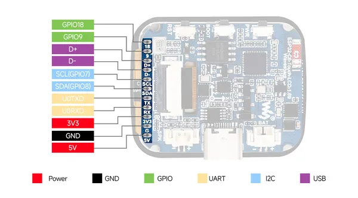
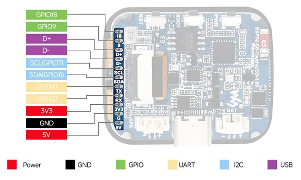

# ESP32-C6-Touch-LCD-1.69

**Waveshare** · ESP32-C6

Revision: Not identified  
Coverage: Pinout image collected

[Browse all manufacturers](../../../../BROWSE.md) · [Desktop app](https://github.com/valleytechsolutions/black-wire-desktop)

## Pinout

**pinout image** · Reviewed source · JPG

[Open original reference](../../../../library/media/b74dba2b6bb145187fc46bd40142bcb74d89b74108e78ed8f6671a0805477e23.jpg)

**Credit and rights:** Not recorded; retain original attribution. Source/manufacturer: Waveshare.

[Source 1](https://www.waveshare.com/img/devkit/ESP32-C6-Touch-LCD-1.69/ESP32-C6-Touch-LCD-1.69-inter.jpg) · [Source 2](https://www.waveshare.com/esp32-c6-touch-lcd-1.69.htm)

SHA-256: `b74dba2b6bb145187fc46bd40142bcb74d89b74108e78ed8f6671a0805477e23`

## Pinout

**pinout image** · Reviewed source · JPG

[Open original reference](../../../../library/media/d98422297979abc0744210851d3cd536248bff295390554a02b49cf004c950e8.jpg)

**Credit and rights:** Not recorded; retain original attribution. Source/manufacturer: Waveshare.

[Source 1](https://www.waveshare.com/w/upload/8/81/800px-ESP32-C6-Touch-LCD-1.69-inter.jpg) · [Source 2](https://www.waveshare.com/wiki/ESP32-C6-Touch-LCD-1.69)

SHA-256: `d98422297979abc0744210851d3cd536248bff295390554a02b49cf004c950e8`

## Pinout

**pinout image** · Reviewed source · WEBP

[Open original reference](../../../../library/media/d45f2b3de3bca4686327b901ebaf80b6d45d9b2fe572039cd9cd1d7354cdc127.webp)

**Credit and rights:** Not recorded; retain original attribution. Source/manufacturer: Waveshare.

[Source 1](https://docs.waveshare.com/assets/images/ESP32-C6-Touch-LCD-1.69-inter-8e4f74988083f8b9d7d89c9e675514ad.webp) · [Source 2](https://docs.waveshare.com/ESP32-C6-Touch-LCD-1.69)

SHA-256: `d45f2b3de3bca4686327b901ebaf80b6d45d9b2fe572039cd9cd1d7354cdc127`

Pin assignments have not been independently electrically verified. Check board revision before wiring.
