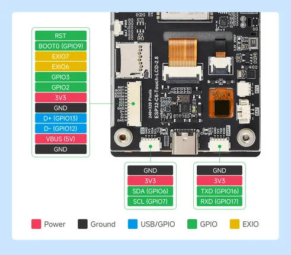
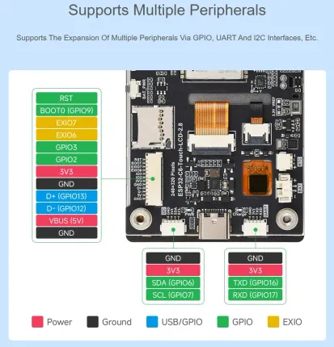

# ESP32-C6-Touch-LCD-2.8

**Waveshare** · ESP32-C6

Revision: Not identified

Coverage: Pinout image collected

[Browse all manufacturers](../../../../BROWSE.md) · [Devices & IoT](../../../../DEVICES.md) · [Open in the browser guide](https://valleytech-black-wire-guide.pages.dev/?board=waveshare-esp32-esp32-c6-touch-lcd-2-8)

## Datasheets and original documentation

Board datasheet: **not yet recorded**. Visual reference: **available**.

[Manufacturer source (recorded link)](https://www.waveshare.com/esp32-c6-touch-lcd-2.8.htm)

A chip datasheet, schematic and board datasheet have different scopes. Match the exact hardware revision.

[Documentation coverage and remaining gaps](../../../../DOCUMENTATION.md)

## Pinout

**pinout image** · Reviewed source · JPG

[Open original reference](../../../../library/media/1871982d71598b7fb4a8cb34618bdbc29e7969c72081c75eba780bf823ea15bd.jpg)

**Credit and rights:** Not recorded; retain original attribution. Source/manufacturer: Waveshare.

[Source 1](https://www.waveshare.com/img/devkit/ESP32-C6-Touch-LCD-2.8/ESP32-C6-Touch-LCD-2.8-details-7.jpg) · [Source 2](https://www.waveshare.com/esp32-c6-touch-lcd-2.8.htm)

Image revision: Not identified

SHA-256: `1871982d71598b7fb4a8cb34618bdbc29e7969c72081c75eba780bf823ea15bd`

## Pinout

**pinout image** · Reviewed source · WEBP

[Open original reference](../../../../library/media/328d289165bb985664578412fb95394835f3cd5cc12c55c09db15e86eaa49299.webp)

**Credit and rights:** Not recorded; retain original attribution. Source/manufacturer: Waveshare.

[Source 1](https://docs.waveshare.com/assets/images/C6-2.8-connenct-7fe36107b631d1a077c65db9ee751982.webp) · [Source 2](https://docs.waveshare.com/ESP32-C6-Touch-LCD-2.8)

Image revision: Not identified

SHA-256: `328d289165bb985664578412fb95394835f3cd5cc12c55c09db15e86eaa49299`

Pin assignments have not been independently electrically verified. Check board revision before wiring.
