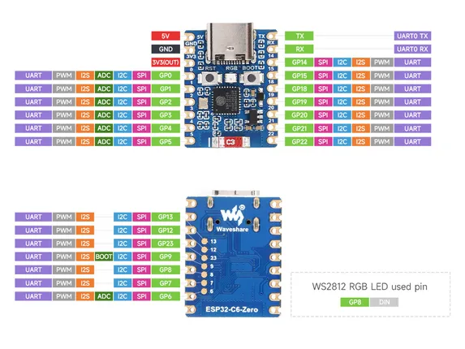
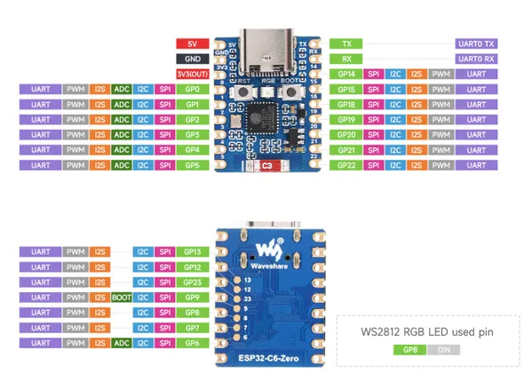

# ESP32-C6-Zero

**Waveshare** · ESP32-C6

Revision: Not identified  
Coverage: Pinout image collected

[Browse all manufacturers](../../../../BROWSE.md) · [Desktop app](https://github.com/valleytechsolutions/black-wire-desktop)

## Pinout

**pinout image** · Reviewed source · JPG

[Open original reference](../../../../library/media/5526a76218dc2aa11e70d7809c611cc2d15f05b2145687025d5a45c6a848247b.jpg)

**Credit and rights:** Not recorded; retain original attribution. Source/manufacturer: Waveshare.

[Source 1](https://www.waveshare.com/img/devkit/ESP32-C6-Zero/ESP32-C6-Zero-details-inter.jpg) · [Source 2](https://www.waveshare.com/esp32-c6-zero.htm)

SHA-256: `5526a76218dc2aa11e70d7809c611cc2d15f05b2145687025d5a45c6a848247b`

## Pinout

**pinout image** · Reviewed source · WEBP

[Open original reference](../../../../library/media/742c0e7db04f0779bbd5a10320448e027d7bce0c3757e79820e7fa9532d2a551.webp)

**Credit and rights:** Not recorded; retain original attribution. Source/manufacturer: Waveshare.

[Source 1](https://docs.waveshare.com/assets/images/ESP32-C6-Zero-Pinout-41ae7de71386ab087c63bd6775b38a81.webp) · [Source 2](https://docs.waveshare.com/ESP32-C6-Zero)

SHA-256: `742c0e7db04f0779bbd5a10320448e027d7bce0c3757e79820e7fa9532d2a551`

## Pinout

**pinout image** · Reviewed source · PNG

[Open original reference](../../../../library/media/611a27ccfc81e01dd4fde7324bf03d93f5d134f30ced9606ea79d4710934c9e0.png)

**Credit and rights:** Not recorded; retain original attribution. Source/manufacturer: Waveshare.

[Source 1](https://www.waveshare.com/w/upload/2/2e/ESP32-C6-Zero_Pin.png) · [Source 2](https://www.waveshare.com/wiki/ESP32-C6-Zero)

SHA-256: `611a27ccfc81e01dd4fde7324bf03d93f5d134f30ced9606ea79d4710934c9e0`

Pin assignments have not been independently electrically verified. Check board revision before wiring.
