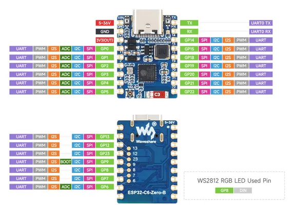
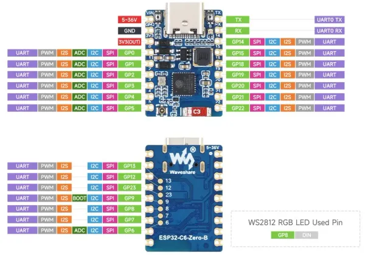

# ESP32-C6-Zero-B

**Waveshare** · ESP32-C6

Revision: Not identified  
Coverage: Pinout image collected

[Browse all manufacturers](../../../../BROWSE.md) · [Desktop app](https://github.com/valleytechsolutions/black-wire-desktop)

## Pinout

**pinout image** · Reviewed source · JPG

[Open original reference](../../../../library/media/23f871986b99dca80b93ae7e52dd6a478ed8e68a55e4fe6d246769f462566942.jpg)

**Credit and rights:** Not recorded; retain original attribution. Source/manufacturer: Waveshare.

[Source 1](https://www.waveshare.com/img/devkit/ESP32-C6-Zero-B/ESP32-C6-Zero-B-details-inter.jpg) · [Source 2](https://www.waveshare.com/esp32-c6-zero-b.htm)

SHA-256: `23f871986b99dca80b93ae7e52dd6a478ed8e68a55e4fe6d246769f462566942`

## Pinout

**pinout image** · Reviewed source · WEBP

[Open original reference](../../../../library/media/ba992cfd4a0d80b61e734dd929ebbdc2c343e335edb965a0a9e1bff76caae7ea.webp)

**Credit and rights:** Not recorded; retain original attribution. Source/manufacturer: Waveshare.

[Source 1](https://docs.waveshare.com/assets/images/ESP32-C6-Zero-B-details-inter-27864efb8f5065a0712aa24a3d8894ce.webp) · [Source 2](https://docs.waveshare.com/ESP32-C6-Zero-B)

SHA-256: `ba992cfd4a0d80b61e734dd929ebbdc2c343e335edb965a0a9e1bff76caae7ea`

Pin assignments have not been independently electrically verified. Check board revision before wiring.
