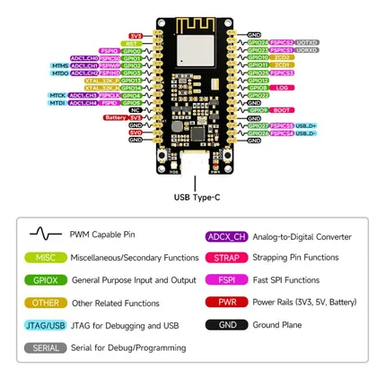

# ESP32-H2-DEV-KIT-N4

**Waveshare** · ESP32-H2

Revision: Not identified  
Coverage: Pinout image collected

[Browse all manufacturers](../../../../BROWSE.md) · [Desktop app](https://github.com/valleytechsolutions/black-wire-desktop)

## Pinout

**pinout image** · Reviewed source · JPG

[Open original reference](../../../../library/media/2144123763e158b49cfb78af519f5e77f87a7f23003a738ab45370fe218af0e8.jpg)

**Credit and rights:** Not recorded; retain original attribution. Source/manufacturer: Waveshare.

[Source 1](https://www.waveshare.com/img/devkit/ESP32-H2-DEV-KIT-N4/ESP32-H2-DEV-KIT-N4-details-11.jpg) · [Source 2](https://www.waveshare.com/esp32-h2-dev-kit-n4.htm)

SHA-256: `2144123763e158b49cfb78af519f5e77f87a7f23003a738ab45370fe218af0e8`

## Pinout

**pinout image** · Reviewed source · WEBP

[Open original reference](../../../../library/media/0c76edafc66e124aeda02175fe5dadc3779d77a2c28b8943f8d73ef8a9a1b184.webp)

**Credit and rights:** Not recorded; retain original attribution. Source/manufacturer: Waveshare.

[Source 1](https://docs.waveshare.com/assets/images/ESP32-H2-DEV-KIT-N4-details-11-e3ec6c337b806edb583d9b047a7daa32.webp) · [Source 2](https://docs.waveshare.com/ESP32-H2-DEV-KIT-N4)

SHA-256: `0c76edafc66e124aeda02175fe5dadc3779d77a2c28b8943f8d73ef8a9a1b184`

## Pinout

**pinout image** · Reviewed source · JPG

[Open original reference](../../../../library/media/010f627002ec97cc0107cdea91e930142976075212a4fda15063a2a6e5d4b859.jpg)

**Credit and rights:** Not recorded; retain original attribution. Source/manufacturer: Waveshare.

[Source 1](https://www.waveshare.com/w/upload/7/75/ESP32-H2-DEV-KIT-N403.jpg) · [Source 2](https://www.waveshare.com/wiki/ESP32-H2-DEV-KIT-N4)

SHA-256: `010f627002ec97cc0107cdea91e930142976075212a4fda15063a2a6e5d4b859`

Pin assignments have not been independently electrically verified. Check board revision before wiring.
