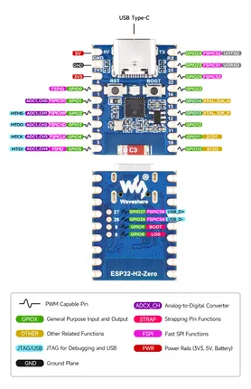

# ESP32-H2-Zero

**Waveshare** · ESP32-H2

Revision: Not identified  
Coverage: Pinout image collected

[Browse all manufacturers](../../../../BROWSE.md) · [Desktop app](https://github.com/valleytechsolutions/black-wire-desktop)

## Pinout

**pinout image** · Reviewed source · JPG

[Open original reference](../../../../library/media/b00ad9622a7c18ffbe76cd068b6944bf57235693e3a98fa5fd596e0f9cf7b4a6.jpg)

**Credit and rights:** Not recorded; retain original attribution. Source/manufacturer: Waveshare.

[Source 1](https://www.waveshare.com/img/devkit/ESP32-H2-Zero/ESP32-H2-Zero-details-inter.jpg) · [Source 2](https://www.waveshare.com/esp32-h2-zero.htm)

SHA-256: `b00ad9622a7c18ffbe76cd068b6944bf57235693e3a98fa5fd596e0f9cf7b4a6`

## Pinout

**pinout image** · Reviewed source · WEBP

[Open original reference](../../../../library/media/4429f98a85b062179df70ebc873556f83949bf01afd4026f0009b0851d29afeb.webp)

**Credit and rights:** Not recorded; retain original attribution. Source/manufacturer: Waveshare.

[Source 1](https://docs.waveshare.com/assets/images/ESP32-H2-Zero-details-inter-cb0ed656ebc63b6579927811d3310a60.webp) · [Source 2](https://docs.waveshare.com/ESP32-H2-Zero)

SHA-256: `4429f98a85b062179df70ebc873556f83949bf01afd4026f0009b0851d29afeb`

## Pinout

**pinout image** · Reviewed source · JPG

[Open original reference](../../../../library/media/0c7b5cb42377e83957853f6568aa948ec151d749578efd20e50e217344656749.jpg)

**Credit and rights:** Not recorded; retain original attribution. Source/manufacturer: Waveshare.

[Source 1](https://www.waveshare.com/w/upload/4/4f/ESP32-H2-Zero-details-inter.jpg) · [Source 2](https://www.waveshare.com/wiki/ESP32-H2-Zero)

SHA-256: `0c7b5cb42377e83957853f6568aa948ec151d749578efd20e50e217344656749`

Pin assignments have not been independently electrically verified. Check board revision before wiring.
