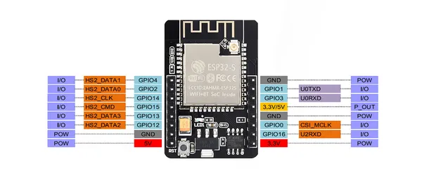

# ESP32-CAM

**Waveshare** · ESP32 original

Revision: Not identified  
Coverage: Pinout image collected

[Browse all manufacturers](../../../../BROWSE.md) · [Desktop app](https://github.com/valleytechsolutions/black-wire-desktop)

## Pinout

**pinout image** · Reviewed source · JPG

[Open original reference](../../../../library/media/347e8439aaaa22f5c80aeadca649ae726c3df3e32e5f26c91e96bff586d5274a.jpg)

**Credit and rights:** Not recorded; retain original attribution. Source/manufacturer: Waveshare.

[Source 1](https://www.waveshare.com/img/devkit/accBoard/ESP32-CAM/ESP32-CAM-MB-details-7.jpg) · [Source 2](https://www.waveshare.com/esp32-cam.htm)

SHA-256: `347e8439aaaa22f5c80aeadca649ae726c3df3e32e5f26c91e96bff586d5274a`

Pin assignments have not been independently electrically verified. Check board revision before wiring.
