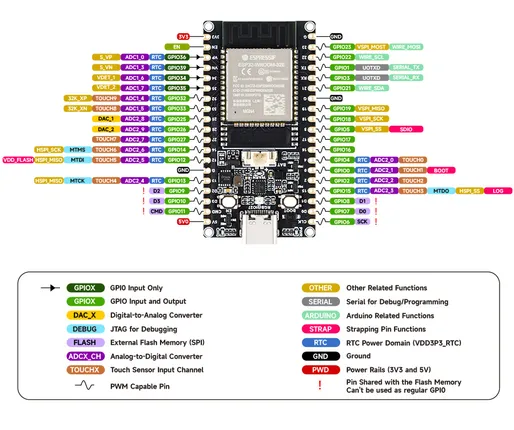
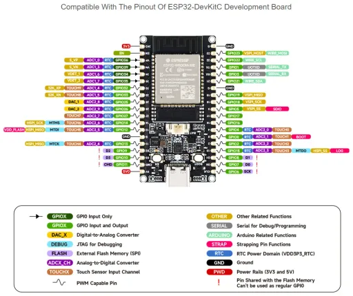

# ESP32-DEV-KIT-XX

**Waveshare** · ESP32 original

Revision: Not identified  
Coverage: Pinout image collected

[Browse all manufacturers](../../../../BROWSE.md) · [Desktop app](https://github.com/valleytechsolutions/black-wire-desktop)

## Pinout

**pinout image** · Reviewed source · JPG

[Open original reference](../../../../library/media/8a005efa7a1a8840e745895622693473e583f9fa06411d87b89e951c357a7a1e.jpg)

**Credit and rights:** Not recorded; retain original attribution. Source/manufacturer: Waveshare.

[Source 1](https://www.waveshare.com/img/devkit/ESP32-DEV-KIT-WROOM-32E-N4/ESP32-DEV-KIT-WROOM-32E-N4-details-9.jpg) · [Source 2](https://www.waveshare.com/esp32-dev-kit-wroxx.htm)

SHA-256: `8a005efa7a1a8840e745895622693473e583f9fa06411d87b89e951c357a7a1e`

## Pinout

**pinout image** · Reviewed source · WEBP

[Open original reference](../../../../library/media/2e60d52c0aee686f702d099499f5378385bfa6af89cfee28a292761dc66d850d.webp)

**Credit and rights:** Not recorded; retain original attribution. Source/manufacturer: Waveshare.

[Source 1](https://docs.waveshare.com/assets/images/ESP32-DEV-KIT-XX-GPIO-5d311a2d0430fc218ab930a2422849a7.webp) · [Source 2](https://docs.waveshare.com/ESP32-DEV-KIT-XX)

SHA-256: `2e60d52c0aee686f702d099499f5378385bfa6af89cfee28a292761dc66d850d`

Pin assignments have not been independently electrically verified. Check board revision before wiring.
