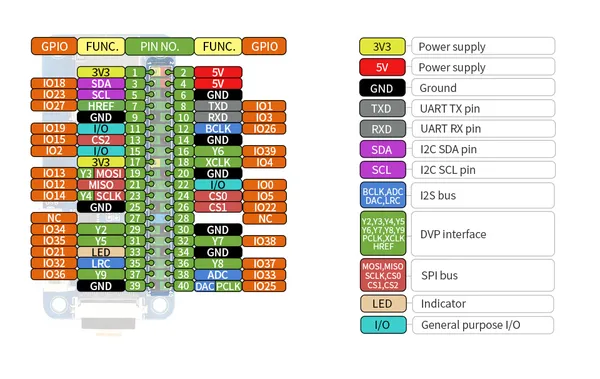

# ESP32 One

**Waveshare** · ESP32 original

Revision: Not identified  
Coverage: Pinout image collected

[Browse all manufacturers](../../../../BROWSE.md) · [Desktop app](https://github.com/valleytechsolutions/black-wire-desktop)

## Pinout

**pinout image** · Reviewed source · JPG

[Open original reference](../../../../library/media/9174eba8f48e9bf7e806a1483606f4d330196d0c469bd51da36ac34031bc8e25.jpg)

**Credit and rights:** Not recorded; retain original attribution. Source/manufacturer: Waveshare.

[Source 1](https://www.waveshare.com/w/upload/f/f7/ESP32-One-details-inter.jpg) · [Source 2](https://www.waveshare.com/wiki/ESP32_One) · [Source 3](https://www.waveshare.com/esp32-one.htm)

SHA-256: `9174eba8f48e9bf7e806a1483606f4d330196d0c469bd51da36ac34031bc8e25`

Pin assignments have not been independently electrically verified. Check board revision before wiring.
