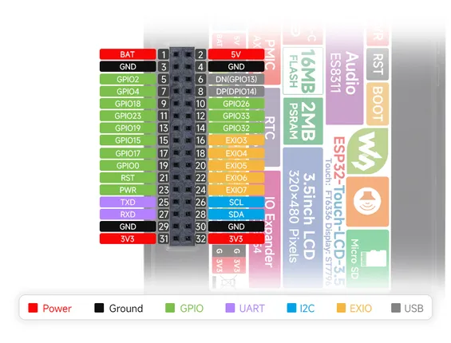
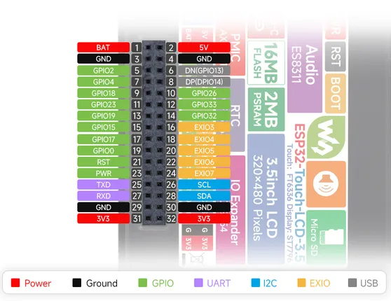

# ESP32-Touch-LCD-3.5

**Waveshare** · ESP32 original

Revision: Not identified  
Coverage: Pinout image collected

[Browse all manufacturers](../../../../BROWSE.md) · [Desktop app](https://github.com/valleytechsolutions/black-wire-desktop)

## Pinout

**pinout image** · Reviewed source · JPG

[Open original reference](../../../../library/media/d2c68a0575fcc5cff78f2926dc3b064dfc5b4c6ad125767b6c0a456aa2ec1ef3.jpg)

**Credit and rights:** Not recorded; retain original attribution. Source/manufacturer: Waveshare.

[Source 1](https://www.waveshare.com/img/devkit/ESP32-Touch-LCD-3.5/ESP32-Touch-LCD-3.5-details-intro.jpg) · [Source 2](https://www.waveshare.com/esp32-touch-lcd-3.5.htm)

SHA-256: `d2c68a0575fcc5cff78f2926dc3b064dfc5b4c6ad125767b6c0a456aa2ec1ef3`

## Pinout

**pinout image** · Reviewed source · WEBP

[Open original reference](../../../../library/media/c62a5b0c4afee96aba9d1734a4dda1f17939ce877f05b2eb135b3522257bdccc.webp)

**Credit and rights:** Not recorded; retain original attribution. Source/manufacturer: Waveshare.

[Source 1](https://docs.waveshare.com/assets/images/ESP32-Touch-LCD-3.5-details-intro-122d8055725da1b1a16436e3da5954a6.webp) · [Source 2](https://docs.waveshare.com/ESP32-Touch-LCD-3.5)

SHA-256: `c62a5b0c4afee96aba9d1734a4dda1f17939ce877f05b2eb135b3522257bdccc`

## Pinout

**pinout image** · Reviewed source · PNG

[Open original reference](../../../../library/media/aafe298ec6621172d948d84598d4068c3995bbf7649f73fef613c68ebe6397cc.png)

**Credit and rights:** Not recorded; retain original attribution. Source/manufacturer: Waveshare.

[Source 1](https://www.waveshare.com/w/upload/3/3f/ESP32-Touch-LCD-3.5-details-intro.png) · [Source 2](https://www.waveshare.com/wiki/ESP32-Touch-LCD-3.5)

SHA-256: `aafe298ec6621172d948d84598d4068c3995bbf7649f73fef613c68ebe6397cc`

Pin assignments have not been independently electrically verified. Check board revision before wiring.
