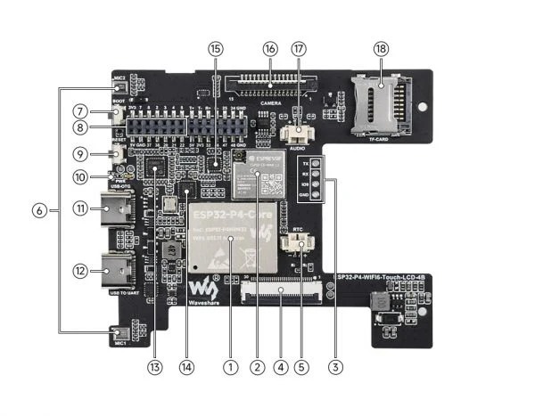
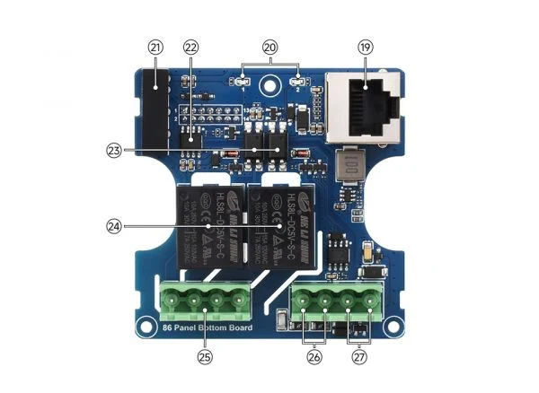
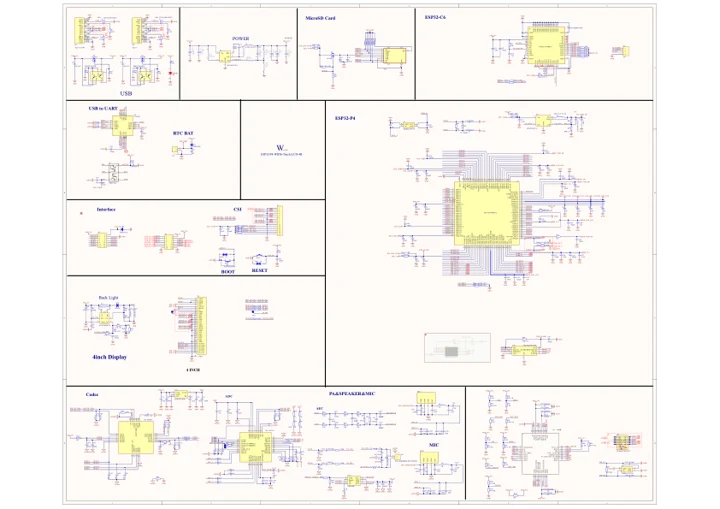
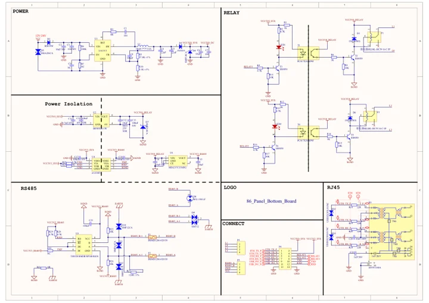

# ESP32-P4-86-Panel-ETH-2RO

**Waveshare** · ESP32-P4

Revision: Not identified

Coverage: Manufacturer references reviewed by scope; independent electrical and all-connector review pending

[Browse all manufacturers](../../../../BROWSE.md) · [Devices & IoT](../../../../DEVICES.md) · [Open in the browser guide](https://valleytech-black-wire-guide.pages.dev/?board=waveshare-esp32-esp32-p4-86-panel-eth-2ro)

## Datasheets and original documentation

Board datasheet: **not yet recorded**. Visual reference: **available**.

[Manufacturer hardware documentation](https://www.waveshare.com/wiki/ESP32-P4-86-Panel-ETH-2RO)

- **schematic / recorded-source**: [ESP32-P4-WIFI6-Touch-LCD-4B Schematic](https://files.waveshare.com/wiki/ESP32-P4-WIFI6-Touch-LCD-4B/ESP32-P4-WIFI6-Touch-LCD-4B.pdf) · [saved document](../../../../library/media/24b9b96d06256dfc613d9a555ae34cb4290b119a3830ac40a07846f81b1e70a1.pdf)
- **schematic / recorded-source**: [86 Panel Bottom Board Schematic](https://files.waveshare.com/wiki/ESP32-P4-WIFI6-Touch-LCD-4B/86_Panel_Bottom_Board.pdf) · [saved document](../../../../library/media/167957dbba2b13f782cbf8319dc491a0228d0f509d35a6a28152035afb08a44f.pdf)
- **hardware-guide / board**: [Manufacturer pin and hardware documentation](https://www.waveshare.com/wiki/ESP32-P4-86-Panel-ETH-2RO) · online

A chip datasheet, schematic and board datasheet have different scopes. Match the exact hardware revision.

[Documentation coverage and remaining gaps](../../../../DOCUMENTATION.md)

## Hardware Description

**board labeling image** · Source identity and visual scope inspected; PDF review covers first-page preview. Independent electrical and all-connector completeness review pending. · JPG

[Open original reference](../../../../library/media/a43d7a5bafe36775be01a5c5775f7a25bf412248e969875d8235d50d6ae5e168.jpg)

**Credit and rights:** Manufacturer artwork; reuse and print rights not established. Inclusion does not relicense the original.. Source/manufacturer: Waveshare.

[Source 1](https://www.waveshare.com/w/upload/f/fc/600px-ESP32-P4-86-Panel-ETH-2RO-details-intro-1.jpg) · [Source 2](https://www.waveshare.com/wiki/ESP32-P4-86-Panel-ETH-2RO)

Manufacturer source retained unchanged. Source identity and visual scope inspected; PDF review covers first-page preview. Independent electrical and all-connector completeness review pending. See the linked manufacturer page for the numbered component legend. This is not a complete physical pinout.

Image revision: As supplied in the original; match exact board revision

SHA-256: `a43d7a5bafe36775be01a5c5775f7a25bf412248e969875d8235d50d6ae5e168`

## Hardware Description

**board labeling image** · Source identity and visual scope inspected; PDF review covers first-page preview. Independent electrical and all-connector completeness review pending. · JPG

[Open original reference](../../../../library/media/1d55fe3988eece6466a3b95e178a84d7f653be89e7f47a5e636bfe37981a3d10.jpg)

**Credit and rights:** Manufacturer artwork; reuse and print rights not established. Inclusion does not relicense the original.. Source/manufacturer: Waveshare.

[Source 1](https://www.waveshare.com/w/upload/f/fc/600px-ESP32-P4-86-Panel-ETH-2RO-details-intro-2.jpg) · [Source 2](https://www.waveshare.com/wiki/ESP32-P4-86-Panel-ETH-2RO)

Manufacturer source retained unchanged. Source identity and visual scope inspected; PDF review covers first-page preview. Independent electrical and all-connector completeness review pending. See the linked manufacturer page for the numbered component legend. This is not a complete physical pinout.

Image revision: As supplied in the original; match exact board revision

SHA-256: `1d55fe3988eece6466a3b95e178a84d7f653be89e7f47a5e636bfe37981a3d10`

## ESP32-P4-WIFI6-Touch-LCD-4B Schematic

**original reference PDF** · Source identity and visual scope inspected; PDF review covers first-page preview. Independent electrical and all-connector completeness review pending. · PDF

[Open original reference](../../../../library/media/24b9b96d06256dfc613d9a555ae34cb4290b119a3830ac40a07846f81b1e70a1.pdf)

**Credit and rights:** Manufacturer artwork; reuse and print rights not established. Inclusion does not relicense the original.. Source/manufacturer: Waveshare.

[Source 1](https://files.waveshare.com/wiki/ESP32-P4-WIFI6-Touch-LCD-4B/ESP32-P4-WIFI6-Touch-LCD-4B.pdf) · [Source 2](https://www.waveshare.com/wiki/ESP32-P4-86-Panel-ETH-2RO)

Manufacturer source retained unchanged. Source identity and visual scope inspected; PDF review covers first-page preview. Independent electrical and all-connector completeness review pending.

Image revision: As supplied in the original; match exact board revision

SHA-256: `24b9b96d06256dfc613d9a555ae34cb4290b119a3830ac40a07846f81b1e70a1`

## 86 Panel Bottom Board Schematic

**original reference PDF** · Source identity and visual scope inspected; PDF review covers first-page preview. Independent electrical and all-connector completeness review pending. · PDF

[Open original reference](../../../../library/media/167957dbba2b13f782cbf8319dc491a0228d0f509d35a6a28152035afb08a44f.pdf)

**Credit and rights:** Manufacturer artwork; reuse and print rights not established. Inclusion does not relicense the original.. Source/manufacturer: Waveshare.

[Source 1](https://files.waveshare.com/wiki/ESP32-P4-WIFI6-Touch-LCD-4B/86_Panel_Bottom_Board.pdf) · [Source 2](https://www.waveshare.com/wiki/ESP32-P4-86-Panel-ETH-2RO)

Manufacturer source retained unchanged. Source identity and visual scope inspected; PDF review covers first-page preview. Independent electrical and all-connector completeness review pending.

Image revision: As supplied in the original; match exact board revision

SHA-256: `167957dbba2b13f782cbf8319dc491a0228d0f509d35a6a28152035afb08a44f`

Pin assignments have not been independently electrically verified. Check board revision before wiring.
