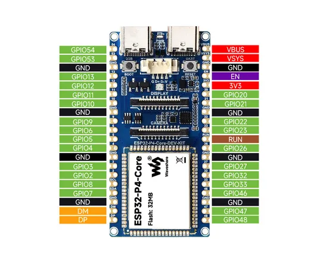

# ESP32-P4-Core-DEV-KIT

**Waveshare** · ESP32-P4

Revision: Not identified  
Coverage: Pinout image collected

[Browse all manufacturers](../../../../BROWSE.md) · [Desktop app](https://github.com/valleytechsolutions/black-wire-desktop)

## Pinout

**pinout image** · Reviewed source · JPG

[Open original reference](../../../../library/media/72341d2524c0a510026ac74082da0fec0102bff5ae06e71c5de935ae1fb2af18.jpg)

**Credit and rights:** Not recorded; retain original attribution. Source/manufacturer: Waveshare.

[Source 1](https://www.waveshare.com/img/devkit/ESP32-P4-Core-DEV-KIT/ESP32-P4-Core-DEV-KIT-details-intro.jpg) · [Source 2](https://www.waveshare.com/esp32-p4-core-dev-kit.htm)

SHA-256: `72341d2524c0a510026ac74082da0fec0102bff5ae06e71c5de935ae1fb2af18`

## Pinout

**pinout image** · Reviewed source · WEBP

[Open original reference](../../../../library/media/860a0ad38c99ff79c31a79c74a87692ce58a2e2e7c52b169b9a2012e8fe00814.webp)

**Credit and rights:** Not recorded; retain original attribution. Source/manufacturer: Waveshare.

[Source 1](https://docs.waveshare.com/assets/images/ESP32-P4-Core-DEV-KIT-details-intro-ecd82e0476c27dcd61342be1c37068e6.webp) · [Source 2](https://docs.waveshare.com/ESP32-P4-Core-DEV-KIT)

SHA-256: `860a0ad38c99ff79c31a79c74a87692ce58a2e2e7c52b169b9a2012e8fe00814`

Pin assignments have not been independently electrically verified. Check board revision before wiring.
