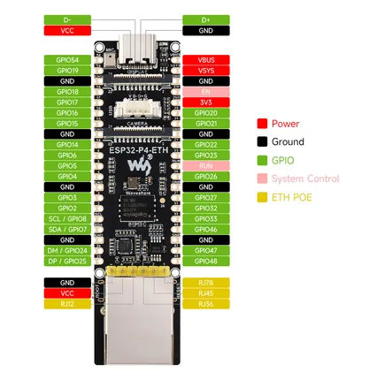
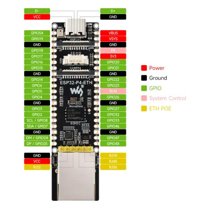

# ESP32-P4-ETH

**Waveshare** · ESP32-P4

Revision: Not identified  
Coverage: Pinout image collected

[Browse all manufacturers](../../../../BROWSE.md) · [Desktop app](https://github.com/valleytechsolutions/black-wire-desktop)

## Pinout

**pinout image** · Reviewed source · JPG

[Open original reference](../../../../library/media/b80a2fa393bc586a302fda8a18cf9b8953f4c1ce499bee898e0941491cae6270.jpg)

**Credit and rights:** Not recorded; retain original attribution. Source/manufacturer: Waveshare.

[Source 1](https://www.waveshare.com/img/devkit/ESP32-P4-ETH/ESP32-P4-ETH-details-inter.jpg) · [Source 2](https://www.waveshare.com/esp32-p4-eth.htm)

SHA-256: `b80a2fa393bc586a302fda8a18cf9b8953f4c1ce499bee898e0941491cae6270`

## Pinout

**pinout image** · Reviewed source · WEBP

[Open original reference](../../../../library/media/2e281ec191257c3899792ec9c4725d4494e5e317273d75dd44412e14f4584e79.webp)

**Credit and rights:** Not recorded; retain original attribution. Source/manufacturer: Waveshare.

[Source 1](https://docs.waveshare.com/assets/images/ESP32-P4-ETH-details-inter-d78f8087f1a1597badd3a1d077c4c057.webp) · [Source 2](https://docs.waveshare.com/ESP32-P4-ETH)

SHA-256: `2e281ec191257c3899792ec9c4725d4494e5e317273d75dd44412e14f4584e79`

## Pinout

**pinout image** · Reviewed source · JPG

[Open original reference](../../../../library/media/e14fbe320e8cbae02c908cc4a66624c58be39694abd12d97830574594edf7e9a.jpg)

**Credit and rights:** Not recorded; retain original attribution. Source/manufacturer: Waveshare.

[Source 1](https://www.waveshare.com/w/upload/5/54/ESP32-P4-ETH-details-inter.jpg) · [Source 2](https://www.waveshare.com/wiki/ESP32-P4-ETH)

SHA-256: `e14fbe320e8cbae02c908cc4a66624c58be39694abd12d97830574594edf7e9a`

Pin assignments have not been independently electrically verified. Check board revision before wiring.
