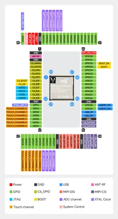
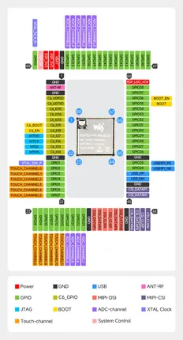

# ESP32-P4-Module

**Waveshare** · ESP32-P4

Revision: Not identified  
Coverage: Pinout image collected

[Browse all manufacturers](../../../../BROWSE.md) · [Desktop app](https://github.com/valleytechsolutions/black-wire-desktop)

## Pinout

**pinout image** · Reviewed source · JPG

[Open original reference](../../../../library/media/69c219d02227a022dcd8015c54568e0dc5716ae6bfc74f09e42d41a5d98465f5.jpg)

**Credit and rights:** Not recorded; retain original attribution. Source/manufacturer: Waveshare.

[Source 1](https://www.waveshare.com/img/devkit/ESP32-P4-Module/ESP32-P4-Module-details-5.jpg?v=26052802) · [Source 2](https://www.waveshare.com/esp32-p4-module.htm)

SHA-256: `69c219d02227a022dcd8015c54568e0dc5716ae6bfc74f09e42d41a5d98465f5`

## Pinout

**pinout image** · Reviewed source · JPG

[Open original reference](../../../../library/media/32ad5c4b47c8e1a4301b1c1ad08c9e510fb3ca9947ef74957be7d711a3888917.jpg)

**Credit and rights:** Not recorded; retain original attribution. Source/manufacturer: Waveshare.

[Source 1](https://www.waveshare.com/w/upload/8/8e/900px-ESP32-P4-Module-details-5.jpg) · [Source 2](https://www.waveshare.com/wiki/ESP32-P4-Module)

SHA-256: `32ad5c4b47c8e1a4301b1c1ad08c9e510fb3ca9947ef74957be7d711a3888917`

Pin assignments have not been independently electrically verified. Check board revision before wiring.
