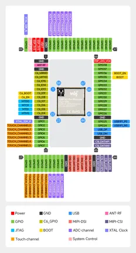
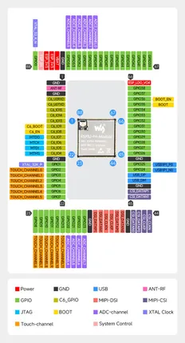

# ESP32-P4-Module

**Waveshare** · ESP32-P4

Revision: Not identified

Coverage: Pinout image collected

[Browse all manufacturers](../../../../BROWSE.md) · [Devices & IoT](../../../../DEVICES.md) · [Open in the browser guide](https://valleytech-black-wire-guide.pages.dev/?board=waveshare-esp32-esp32-p4-module)

## Datasheets and original documentation

Board datasheet: **not yet recorded**. Visual reference: **available**.

[Manufacturer source (recorded link)](https://www.waveshare.com/esp32-p4-module.htm)

A chip datasheet, schematic and board datasheet have different scopes. Match the exact hardware revision.

[Documentation coverage and remaining gaps](../../../../DOCUMENTATION.md)

## Pinout

**pinout image** · Reviewed source · JPG

[Open original reference](../../../../library/media/69c219d02227a022dcd8015c54568e0dc5716ae6bfc74f09e42d41a5d98465f5.jpg)

**Credit and rights:** Not recorded; retain original attribution. Source/manufacturer: Waveshare.

[Source 1](https://www.waveshare.com/img/devkit/ESP32-P4-Module/ESP32-P4-Module-details-5.jpg?v=26052802) · [Source 2](https://www.waveshare.com/esp32-p4-module.htm)

Image revision: Not identified

SHA-256: `69c219d02227a022dcd8015c54568e0dc5716ae6bfc74f09e42d41a5d98465f5`

## Pinout

**pinout image** · Reviewed source · JPG

[Open original reference](../../../../library/media/32ad5c4b47c8e1a4301b1c1ad08c9e510fb3ca9947ef74957be7d711a3888917.jpg)

**Credit and rights:** Not recorded; retain original attribution. Source/manufacturer: Waveshare.

[Source 1](https://www.waveshare.com/w/upload/8/8e/900px-ESP32-P4-Module-details-5.jpg) · [Source 2](https://www.waveshare.com/wiki/ESP32-P4-Module)

Image revision: Not identified

SHA-256: `32ad5c4b47c8e1a4301b1c1ad08c9e510fb3ca9947ef74957be7d711a3888917`

Pin assignments have not been independently electrically verified. Check board revision before wiring.
