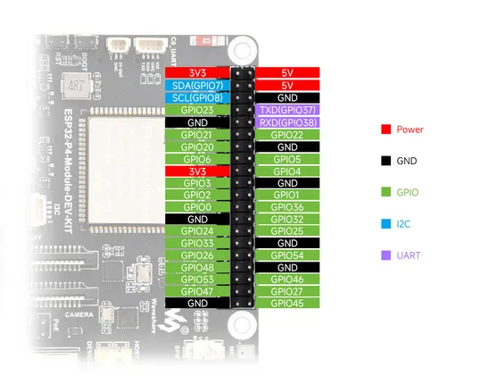
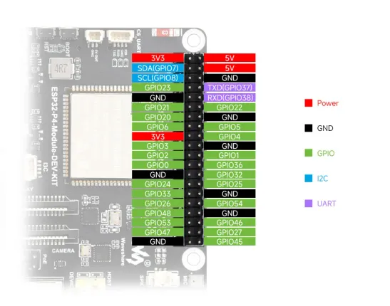

# ESP32-P4-Module-DEV-KIT

**Waveshare** · ESP32-P4

Revision: Not identified  
Coverage: Pinout image collected

[Browse all manufacturers](../../../../BROWSE.md) · [Desktop app](https://github.com/valleytechsolutions/black-wire-desktop)

## Pinout

**pinout image** · Reviewed source · JPG

[Open original reference](../../../../library/media/7fbc81b16d73f00340de7687e5bb56dc80349c6b8a439126f01393af3d6c5c05.jpg)

**Credit and rights:** Not recorded; retain original attribution. Source/manufacturer: Waveshare.

[Source 1](https://www.waveshare.com/img/devkit/ESP32-P4-Module-DEV-KIT/ESP32-P4-Module-DEV-KIT-details-intro.jpg) · [Source 2](https://www.waveshare.com/esp32-p4-module-dev-kit.htm)

SHA-256: `7fbc81b16d73f00340de7687e5bb56dc80349c6b8a439126f01393af3d6c5c05`

## Pinout

**pinout image** · Reviewed source · WEBP

[Open original reference](../../../../library/media/fec35388ff60f16c2213b40e06f7296dd178a0b07d2ed0abfea35dbb751f67f6.webp)

**Credit and rights:** Not recorded; retain original attribution. Source/manufacturer: Waveshare.

[Source 1](https://docs.waveshare.com/assets/images/ESP32-P4-Module-DEV-KIT-details-intro-0c4dab98d7d37956d9339e02b96f6011.webp) · [Source 2](https://docs.waveshare.com/ESP32-P4-Module-DEV-KIT)

SHA-256: `fec35388ff60f16c2213b40e06f7296dd178a0b07d2ed0abfea35dbb751f67f6`

Pin assignments have not been independently electrically verified. Check board revision before wiring.
