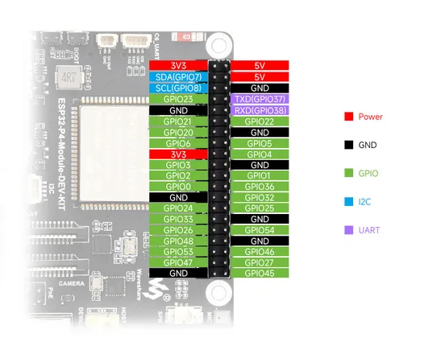
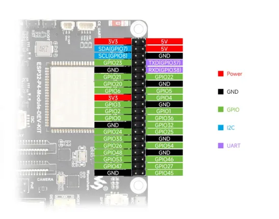
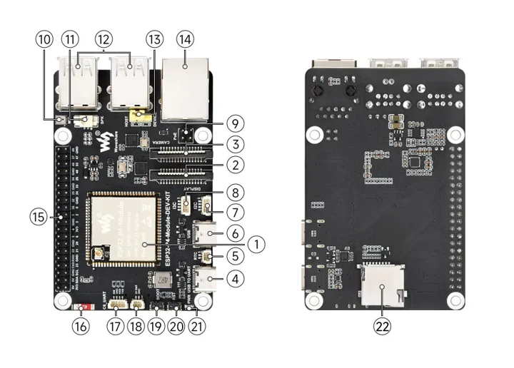
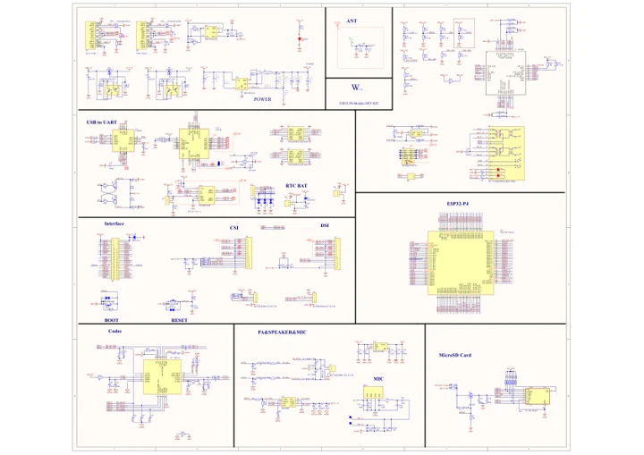

# ESP32-P4-Module-DEV-KIT

**Waveshare** · ESP32-P4

Revision: Not identified

Coverage: Manufacturer references reviewed by scope; independent electrical and all-connector review pending

[Browse all manufacturers](../../../../BROWSE.md) · [Devices & IoT](../../../../DEVICES.md) · [Open in the browser guide](https://valleytech-black-wire-guide.pages.dev/?board=waveshare-esp32-esp32-p4-module-dev-kit)

## Datasheets and original documentation

Board datasheet: **not yet recorded**. Visual reference: **available**.

[Manufacturer hardware documentation](https://docs.waveshare.com/ESP32-P4-Module-DEV-KIT)

- **schematic / board**: [ESP32-P4-Module-DEV-KIT Schematic Diagram](https://files.waveshare.com/wiki/ESP32-P4-Module-DEV-KIT/ESP32-P4-Module-DEV-KIT.pdf) · [saved document](../../../../library/media/9c0d24ff8f68ad32621f0a07a799ddfb9abc424959cca0ce331bad4acbc173fe.pdf)
- **hardware-guide / board**: [Manufacturer pin and hardware documentation](https://docs.waveshare.com/ESP32-P4-Module-DEV-KIT) · online

A chip datasheet, schematic and board datasheet have different scopes. Match the exact hardware revision.

[Documentation coverage and remaining gaps](../../../../DOCUMENTATION.md)

## Pinout

**pinout image** · Reviewed source · JPG

[Open original reference](../../../../library/media/7fbc81b16d73f00340de7687e5bb56dc80349c6b8a439126f01393af3d6c5c05.jpg)

**Credit and rights:** Not recorded; retain original attribution. Source/manufacturer: Waveshare.

[Source 1](https://www.waveshare.com/img/devkit/ESP32-P4-Module-DEV-KIT/ESP32-P4-Module-DEV-KIT-details-intro.jpg) · [Source 2](https://www.waveshare.com/esp32-p4-module-dev-kit.htm)

Image revision: Not identified

SHA-256: `7fbc81b16d73f00340de7687e5bb56dc80349c6b8a439126f01393af3d6c5c05`

## Pinout

**pinout image** · Reviewed source · WEBP

[Open original reference](../../../../library/media/fec35388ff60f16c2213b40e06f7296dd178a0b07d2ed0abfea35dbb751f67f6.webp)

**Credit and rights:** Not recorded; retain original attribution. Source/manufacturer: Waveshare.

[Source 1](https://docs.waveshare.com/assets/images/ESP32-P4-Module-DEV-KIT-details-intro-0c4dab98d7d37956d9339e02b96f6011.webp) · [Source 2](https://docs.waveshare.com/ESP32-P4-Module-DEV-KIT)

Image revision: Not identified

SHA-256: `fec35388ff60f16c2213b40e06f7296dd178a0b07d2ed0abfea35dbb751f67f6`

## Hardware Description ​

**board labeling image** · Source identity and visual scope inspected; PDF review covers first-page preview. Independent electrical and all-connector completeness review pending. · WEBP

[Open original reference](../../../../library/media/e307712de5d5180e227a1edcb1f96914973e01dc50ed948b4ced977ee14cc4b3.webp)

**Credit and rights:** Manufacturer artwork; reuse and print rights not established. Inclusion does not relicense the original.. Source/manufacturer: Waveshare.

[Source 1](https://docs.waveshare.com/assets/images/ESP32-P4-Module-DEV-KIT-details-inter-ef8905ee9df6bbfa16bed6e5ef93ea37.webp) · [Source 2](https://docs.waveshare.com/ESP32-P4-Module-DEV-KIT)

Manufacturer source retained unchanged. Source identity and visual scope inspected; PDF review covers first-page preview. Independent electrical and all-connector completeness review pending. See the linked manufacturer page for the numbered component legend. This is not a complete physical pinout.

Image revision: As supplied in the original; match exact board revision

SHA-256: `e307712de5d5180e227a1edcb1f96914973e01dc50ed948b4ced977ee14cc4b3`

## ESP32-P4-Module-DEV-KIT Schematic Diagram

**original reference PDF** · Source identity and visual scope inspected; PDF review covers first-page preview. Independent electrical and all-connector completeness review pending. · PDF

[Open original reference](../../../../library/media/9c0d24ff8f68ad32621f0a07a799ddfb9abc424959cca0ce331bad4acbc173fe.pdf)

**Credit and rights:** Manufacturer artwork; reuse and print rights not established. Inclusion does not relicense the original.. Source/manufacturer: Waveshare.

[Source 1](https://files.waveshare.com/wiki/ESP32-P4-Module-DEV-KIT/ESP32-P4-Module-DEV-KIT.pdf) · [Source 2](https://docs.waveshare.com/ESP32-P4-Module-DEV-KIT/Resources-And-Documents)

Manufacturer source retained unchanged. Source identity and visual scope inspected; PDF review covers first-page preview. Independent electrical and all-connector completeness review pending.

Image revision: As supplied in the original; match exact board revision

SHA-256: `9c0d24ff8f68ad32621f0a07a799ddfb9abc424959cca0ce331bad4acbc173fe`

Pin assignments have not been independently electrically verified. Check board revision before wiring.
