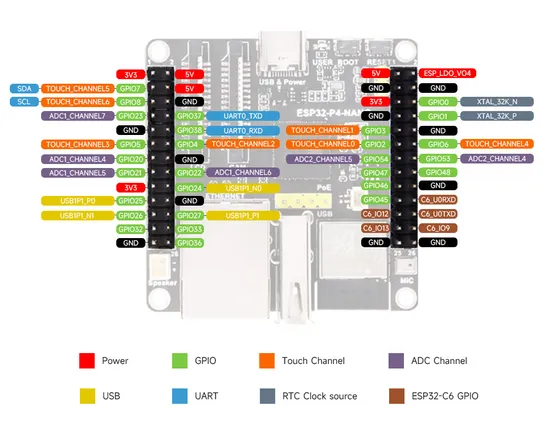

# ESP32-P4-NANO

**Waveshare** · ESP32-P4

Revision: Not identified  
Coverage: Pinout image collected

[Browse all manufacturers](../../../../BROWSE.md) · [Desktop app](https://github.com/valleytechsolutions/black-wire-desktop)

## Pinout

**pinout image** · Reviewed source · JPG

[Open original reference](../../../../library/media/d8b41963b85ec6e0e79e489f9a4ad908b6906e2e2e8cd7a251fc2e5a45a4ac4e.jpg)

**Credit and rights:** Not recorded; retain original attribution. Source/manufacturer: Waveshare.

[Source 1](https://www.waveshare.com/img/devkit/ESP32-P4-NANO/ESP32-P4-NANO-details-inter.jpg) · [Source 2](https://www.waveshare.com/esp32-p4-nano.htm)

SHA-256: `d8b41963b85ec6e0e79e489f9a4ad908b6906e2e2e8cd7a251fc2e5a45a4ac4e`

## Pinout

**pinout image** · Reviewed source · WEBP

[Open original reference](../../../../library/media/e8ce6de6b699d11fdcf9383bd3e14709980fc15dea4283b1d64f804631f81319.webp)

**Credit and rights:** Not recorded; retain original attribution. Source/manufacturer: Waveshare.

[Source 1](https://docs.waveshare.com/assets/images/ESP32-P4-NANO-details-inter-7d57c8d9e67e7deb6af7fbf47ba97a1a.webp) · [Source 2](https://docs.waveshare.com/ESP32-P4-NANO)

SHA-256: `e8ce6de6b699d11fdcf9383bd3e14709980fc15dea4283b1d64f804631f81319`

Pin assignments have not been independently electrically verified. Check board revision before wiring.
