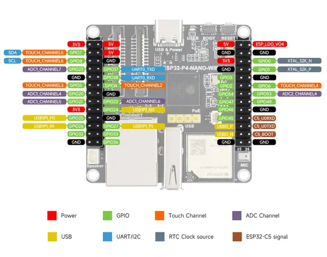
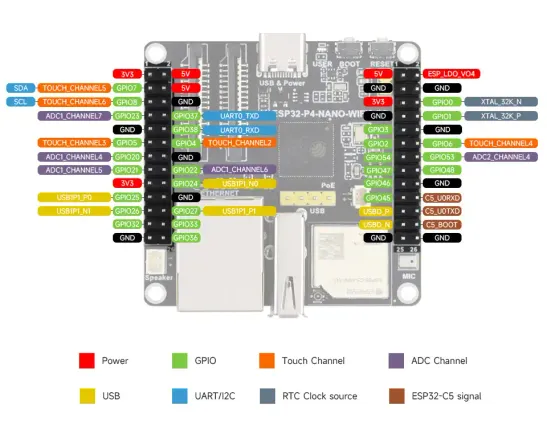

# ESP32-P4-NANO-WIFI6-DB

**Waveshare** · ESP32-P4

Revision: Not identified  
Coverage: Pinout image collected

[Browse all manufacturers](../../../../BROWSE.md) · [Desktop app](https://github.com/valleytechsolutions/black-wire-desktop)

## Pinout

**pinout image** · Reviewed source · JPG

[Open original reference](../../../../library/media/5a7b8826c6c23c0b2e14e66037247c0cab8703cdf964a50ffbc640f13dc734cb.jpg)

**Credit and rights:** Not recorded; retain original attribution. Source/manufacturer: Waveshare.

[Source 1](https://www.waveshare.com/img/devkit/ESP32-P4-NANO-WIFI6-DB/ESP32-P4-NANO-WIFI6-DB-details-inter.jpg) · [Source 2](https://www.waveshare.com/esp32-p4-nano-wifi6-db.htm)

SHA-256: `5a7b8826c6c23c0b2e14e66037247c0cab8703cdf964a50ffbc640f13dc734cb`

## Pinout

**pinout image** · Reviewed source · WEBP

[Open original reference](../../../../library/media/91869b1b30e130addb0fc89067906470b69571db95a363753bfd1ecbaf859031.webp)

**Credit and rights:** Not recorded; retain original attribution. Source/manufacturer: Waveshare.

[Source 1](https://docs.waveshare.com/assets/images/ESP32-P4-NANO-WIFI6-DB-details-inter-a9538e66b6f1c4eb40f5e202e15f4f30.webp) · [Source 2](https://docs.waveshare.com/ESP32-P4-NANO-WIFI6-DB)

SHA-256: `91869b1b30e130addb0fc89067906470b69571db95a363753bfd1ecbaf859031`

Pin assignments have not been independently electrically verified. Check board revision before wiring.
