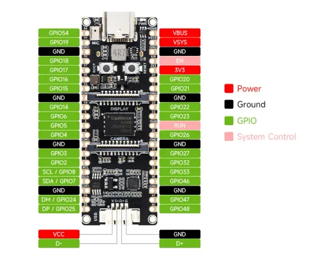

# ESP32-P4-Pico

**Waveshare** · ESP32-P4

Revision: Not identified  
Coverage: Pinout image collected

[Browse all manufacturers](../../../../BROWSE.md) · [Desktop app](https://github.com/valleytechsolutions/black-wire-desktop)

## Pinout

**pinout image** · Reviewed source · WEBP

[Open original reference](../../../../library/media/256350363eeb6c3042a42c214cc281c8a422bf80242628c5e73e53b773017cf8.webp)

**Credit and rights:** Not recorded; retain original attribution. Source/manufacturer: Waveshare.

[Source 1](https://docs.waveshare.com/assets/images/ESP32-P4-Pico-details-inter-c1e693aeee12aeb03a9a2fc1c44510f5.webp) · [Source 2](https://docs.waveshare.com/ESP32-P4-Pico)

SHA-256: `256350363eeb6c3042a42c214cc281c8a422bf80242628c5e73e53b773017cf8`

## Pinout

**pinout image** · Reviewed source · JPG

[Open original reference](../../../../library/media/9603333efd112d12daa8254cef44b96a346987b388acf32cca407ae4b7b1c236.jpg)

**Credit and rights:** Not recorded; retain original attribution. Source/manufacturer: Waveshare.

[Source 1](https://www.waveshare.com/w/upload/9/9b/ESP32-P4-Pico-details-inter.jpg) · [Source 2](https://www.waveshare.com/wiki/ESP32-P4-Pico) · [Source 3](https://www.waveshare.com/esp32-p4-pico.htm)

SHA-256: `9603333efd112d12daa8254cef44b96a346987b388acf32cca407ae4b7b1c236`

Pin assignments have not been independently electrically verified. Check board revision before wiring.
