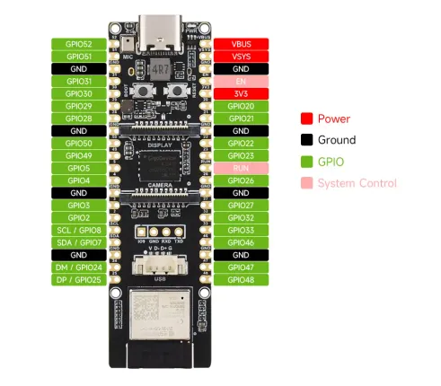
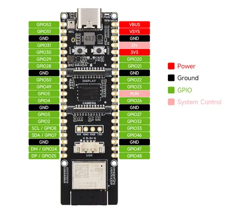

# ESP32-P4-WIFI6

**Waveshare** · ESP32-P4

Revision: Not identified  
Coverage: Pinout image collected

[Browse all manufacturers](../../../../BROWSE.md) · [Desktop app](https://github.com/valleytechsolutions/black-wire-desktop)

## Pinout

**pinout image** · Reviewed source · WEBP

[Open original reference](../../../../library/media/a71ba89aa368d479e7f915a5b8942d35a629067278d1811ce77854125d28e903.webp)

**Credit and rights:** Not recorded; retain original attribution. Source/manufacturer: Waveshare.

[Source 1](https://docs.waveshare.com/assets/images/ESP32-P4-WIFI6-details-inter-3472c9ea8e7f1e2665531f8d7e954e06.webp) · [Source 2](https://docs.waveshare.com/ESP32-P4-WIFI6)

SHA-256: `a71ba89aa368d479e7f915a5b8942d35a629067278d1811ce77854125d28e903`

## Pinout

**pinout image** · Reviewed source · JPG

[Open original reference](../../../../library/media/c3edc5d765487b3fb7ce70b4b82b558e08f0edf85ae600ed20859849bbb72046.jpg)

**Credit and rights:** Not recorded; retain original attribution. Source/manufacturer: Waveshare.

[Source 1](https://www.waveshare.com/w/upload/e/e2/ESP32-P4-WIFI6-details-inter.jpg) · [Source 2](https://www.waveshare.com/wiki/ESP32-P4-WIFI6) · [Source 3](https://www.waveshare.com/esp32-p4-wifi6.htm)

SHA-256: `c3edc5d765487b3fb7ce70b4b82b558e08f0edf85ae600ed20859849bbb72046`

Pin assignments have not been independently electrically verified. Check board revision before wiring.
