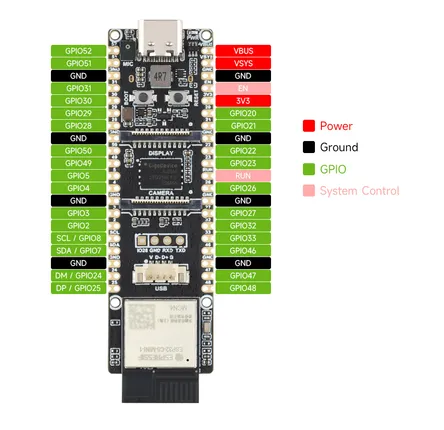

# ESP32-P4-WIFI6-DB

**Waveshare** · ESP32-P4

Revision: Not identified  
Coverage: Pinout image collected

[Browse all manufacturers](../../../../BROWSE.md) · [Desktop app](https://github.com/valleytechsolutions/black-wire-desktop)

## Pinout

**pinout image** · Reviewed source · JPG

[Open original reference](../../../../library/media/6621f869610dda9e066e73e9de17573f2607eb89fdf956b355fe50e0038df0b9.jpg)

**Credit and rights:** Not recorded; retain original attribution. Source/manufacturer: Waveshare.

[Source 1](https://www.waveshare.com/img/devkit/ESP32-P4-WIFI6-DB/ESP32-P4-WIFI6-DB-details-inter.jpg) · [Source 2](https://www.waveshare.com/esp32-p4-wifi6-db.htm)

SHA-256: `6621f869610dda9e066e73e9de17573f2607eb89fdf956b355fe50e0038df0b9`

Pin assignments have not been independently electrically verified. Check board revision before wiring.
