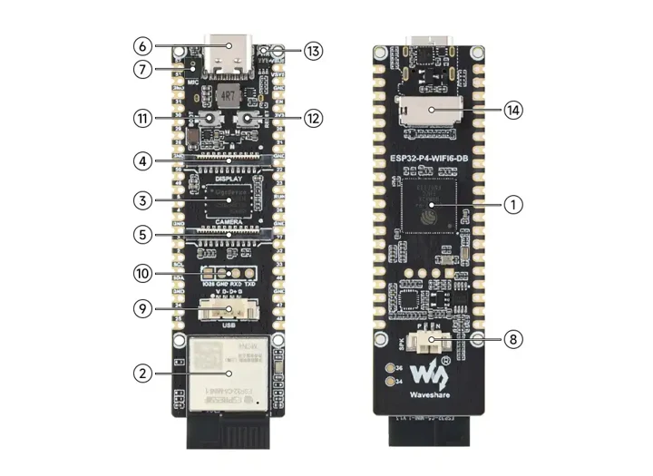
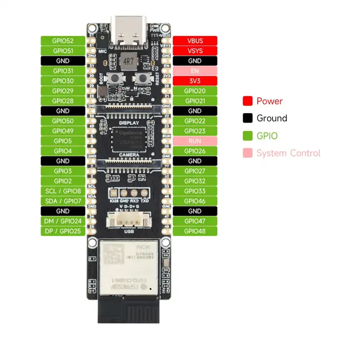
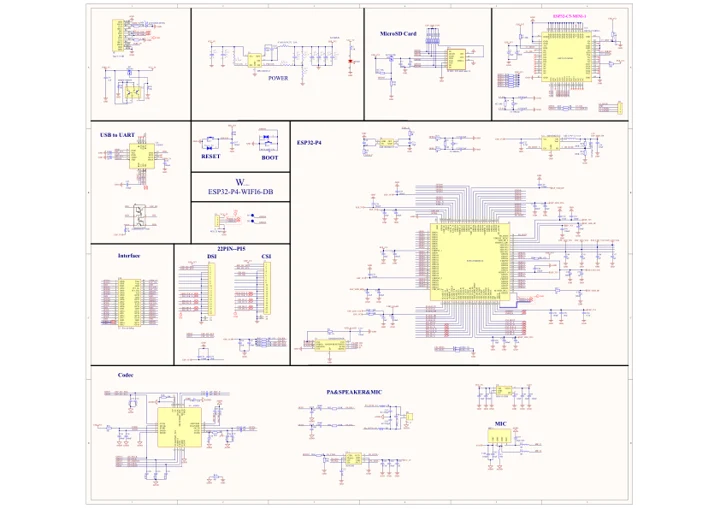

# ESP32-P4-WIFI6-DB

**Waveshare** · ESP32-P4

Revision: Not identified

Coverage: Manufacturer references reviewed by scope; independent electrical and all-connector review pending

[Browse all manufacturers](../../../../BROWSE.md) · [Devices & IoT](../../../../DEVICES.md) · [Open in the browser guide](https://valleytech-black-wire-guide.pages.dev/?board=waveshare-esp32-esp32-p4-wifi6-db)

## Datasheets and original documentation

Board datasheet: **not yet recorded**. Visual reference: **available**.

[Manufacturer hardware documentation](https://docs.waveshare.com/ESP32-P4-WIFI6-DB)

- **schematic / board**: [ESP32-P4-WIFI6-DB Schematic](https://github.com/waveshareteam/ESP32-P4-WIFI6-DB/raw/main/hardware/ESP32-P4-WIFI6-DB.pdf) · [saved document](../../../../library/media/63244863dca7e054c72a0b0e16a3947d4983a455d03af784e00009f340f88977.pdf)
- **hardware-guide / board**: [Manufacturer pin and hardware documentation](https://docs.waveshare.com/ESP32-P4-WIFI6-DB) · online

A chip datasheet, schematic and board datasheet have different scopes. Match the exact hardware revision.

[Documentation coverage and remaining gaps](../../../../DOCUMENTATION.md)

## Pinout

**pinout image** · Reviewed source · JPG

[Open original reference](../../../../library/media/6621f869610dda9e066e73e9de17573f2607eb89fdf956b355fe50e0038df0b9.jpg)

**Credit and rights:** Not recorded; retain original attribution. Source/manufacturer: Waveshare.

[Source 1](https://www.waveshare.com/img/devkit/ESP32-P4-WIFI6-DB/ESP32-P4-WIFI6-DB-details-inter.jpg) · [Source 2](https://www.waveshare.com/esp32-p4-wifi6-db.htm)

Image revision: Not identified

SHA-256: `6621f869610dda9e066e73e9de17573f2607eb89fdf956b355fe50e0038df0b9`

## Onboard Resources ​

**board labeling image** · Source identity and visual scope inspected; PDF review covers first-page preview. Independent electrical and all-connector completeness review pending. · WEBP

[Open original reference](../../../../library/media/3daa07f497197e49f02b2485ed55c92570999f6a53682a8804be476583463a13.webp)

**Credit and rights:** Manufacturer artwork; reuse and print rights not established. Inclusion does not relicense the original.. Source/manufacturer: Waveshare.

[Source 1](https://docs.waveshare.com/assets/images/ESP32-P4-WIFI6-DB-details-intro-8c195ffb8b1cfc139825e257e9be3e59.webp) · [Source 2](https://docs.waveshare.com/ESP32-P4-WIFI6-DB)

Manufacturer source retained unchanged. Source identity and visual scope inspected; PDF review covers first-page preview. Independent electrical and all-connector completeness review pending. See the linked manufacturer page for the numbered component legend. This is not a complete physical pinout.

Image revision: As supplied in the original; match exact board revision

SHA-256: `3daa07f497197e49f02b2485ed55c92570999f6a53682a8804be476583463a13`

## Pin Definitions ​

**pinout image** · Source identity and visual scope inspected; PDF review covers first-page preview. Independent electrical and all-connector completeness review pending. · WEBP

[Open original reference](../../../../library/media/a0c99e06aff5750b6c696357efff7fe9c15ee0144df1b7884b914e79af595d55.webp)

**Credit and rights:** Manufacturer artwork; reuse and print rights not established. Inclusion does not relicense the original.. Source/manufacturer: Waveshare.

[Source 1](https://docs.waveshare.com/assets/images/ESP32-P4-WIFI6-DB-details-inter-bf65f5316f0b173d1344f9ab9da78ec3.webp) · [Source 2](https://docs.waveshare.com/ESP32-P4-WIFI6-DB)

Manufacturer source retained unchanged. Source identity and visual scope inspected; PDF review covers first-page preview. Independent electrical and all-connector completeness review pending.

Image revision: As supplied in the original; match exact board revision

SHA-256: `a0c99e06aff5750b6c696357efff7fe9c15ee0144df1b7884b914e79af595d55`

## ESP32-P4-WIFI6-DB Schematic

**original reference PDF** · Source identity and visual scope inspected; PDF review covers first-page preview. Independent electrical and all-connector completeness review pending. · PDF

[Open original reference](../../../../library/media/63244863dca7e054c72a0b0e16a3947d4983a455d03af784e00009f340f88977.pdf)

**Credit and rights:** Manufacturer artwork; reuse and print rights not established. Inclusion does not relicense the original.. Source/manufacturer: Waveshare.

[Source 1](https://github.com/waveshareteam/ESP32-P4-WIFI6-DB/raw/main/hardware/ESP32-P4-WIFI6-DB.pdf) · [Source 2](https://docs.waveshare.com/ESP32-P4-WIFI6-DB/Resources-And-Documents)

Manufacturer source retained unchanged. Source identity and visual scope inspected; PDF review covers first-page preview. Independent electrical and all-connector completeness review pending.

Image revision: As supplied in the original; match exact board revision

SHA-256: `63244863dca7e054c72a0b0e16a3947d4983a455d03af784e00009f340f88977`

Pin assignments have not been independently electrically verified. Check board revision before wiring.
