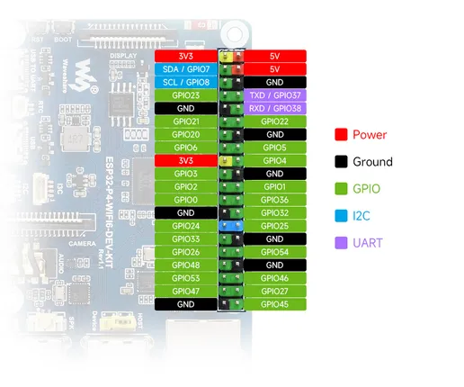
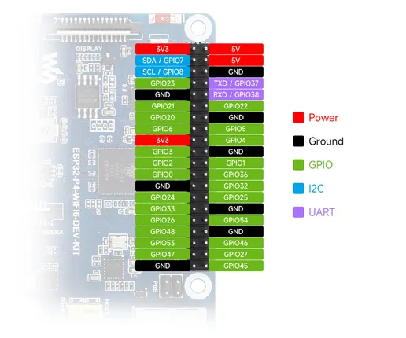

# ESP32-P4-WIFI6-DEV-KIT

**Waveshare** · ESP32-P4

Revision: Not identified  
Coverage: Pinout image collected

[Browse all manufacturers](../../../../BROWSE.md) · [Desktop app](https://github.com/valleytechsolutions/black-wire-desktop)

## Pinout

**pinout image** · Reviewed source · JPG

[Open original reference](../../../../library/media/3c74603ef1ea7caeabe5e02acededb3638d5f1f789525b4c956f8ea8b443bbd7.jpg)

**Credit and rights:** Not recorded; retain original attribution. Source/manufacturer: Waveshare.

[Source 1](https://www.waveshare.com/img/devkit/ESP32-P4-WIFI6-DEV-KIT/ESP32-P4-WIFI6-DEV-KIT-details-inter.jpg?v=26061103) · [Source 2](https://www.waveshare.com/esp32-p4-wifi6-dev-kit.htm)

SHA-256: `3c74603ef1ea7caeabe5e02acededb3638d5f1f789525b4c956f8ea8b443bbd7`

## Pinout

**pinout image** · Reviewed source · WEBP

[Open original reference](../../../../library/media/9fd56670366a6a4858a42adcc0164ddf84539b7935f143834c323630157b2c0f.webp)

**Credit and rights:** Not recorded; retain original attribution. Source/manufacturer: Waveshare.

[Source 1](https://docs.waveshare.com/assets/images/ESP32-P4-WIFI6-DEV-KIT-details-inter-58dc403e711dfb74147d78cd699fa49e.webp) · [Source 2](https://docs.waveshare.com/ESP32-P4-WIFI6-DEV-KIT)

SHA-256: `9fd56670366a6a4858a42adcc0164ddf84539b7935f143834c323630157b2c0f`

## Pinout

**pinout image** · Reviewed source · JPG

[Open original reference](../../../../library/media/5d3736259ee0b3aec8593478502969926a8ea35a7daebc7169862fbb07f496bd.jpg)

**Credit and rights:** Not recorded; retain original attribution. Source/manufacturer: Waveshare.

[Source 1](https://www.waveshare.com/w/upload/f/f8/ESP32-P4-WIFI6-DEV-KIT-details-inter.jpg) · [Source 2](https://www.waveshare.com/wiki/ESP32-P4-WIFI6-DEV-KIT)

SHA-256: `5d3736259ee0b3aec8593478502969926a8ea35a7daebc7169862fbb07f496bd`

Pin assignments have not been independently electrically verified. Check board revision before wiring.
