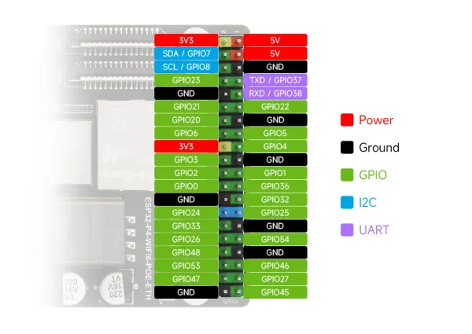
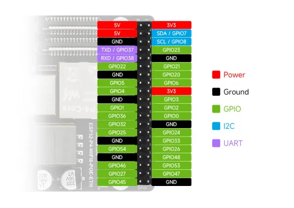
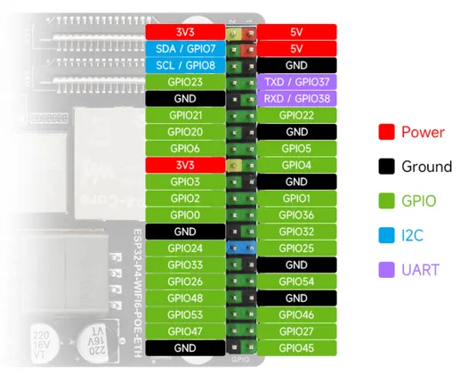

# ESP32-P4-WIFI6-POE-ETH

**Waveshare** · ESP32-P4

Revision: Not identified  
Coverage: Pinout image collected

[Browse all manufacturers](../../../../BROWSE.md) · [Desktop app](https://github.com/valleytechsolutions/black-wire-desktop)

## Pinout

**pinout image** · Reviewed source · WEBP

[Open original reference](../../../../library/media/9b6892a66bfadc64c9c8810d2a2dd3ac20a4ffa68ea4ac8b0dbfe929ee8d7535.webp)

**Credit and rights:** Not recorded; retain original attribution. Source/manufacturer: Waveshare.

[Source 1](https://docs.waveshare.com/assets/images/ESP32-P4-WIFI6-POE-ETH-details-inter-9a44d25075d91a5039181189b5e82867.webp) · [Source 2](https://docs.waveshare.com/ESP32-P4-WIFI6-POE-ETH)

SHA-256: `9b6892a66bfadc64c9c8810d2a2dd3ac20a4ffa68ea4ac8b0dbfe929ee8d7535`

## Pinout

**pinout image** · Reviewed source · WEBP

[Open original reference](../../../../library/media/c9b3b932465f56512c98d56e6e3a3fce89a5618a1b5fe9a3e90368522ffdfa25.webp)

**Credit and rights:** Not recorded; retain original attribution. Source/manufacturer: Waveshare.

[Source 1](https://docs.waveshare.com/assets/images/ESP32-P4-WIFI6-POE-ETH-details-inter-2-bc32d0b522f12d2743cb5eb34544484e.webp) · [Source 2](https://docs.waveshare.com/ESP32-P4-WIFI6-POE-ETH)

SHA-256: `c9b3b932465f56512c98d56e6e3a3fce89a5618a1b5fe9a3e90368522ffdfa25`

## Pinout

**pinout image** · Reviewed source · JPG

[Open original reference](../../../../library/media/d30e20080e55da3e40f2491fc9c0b26ae2622223ccfb0e02ee55ee72a8f1c615.jpg)

**Credit and rights:** Not recorded; retain original attribution. Source/manufacturer: Waveshare.

[Source 1](https://www.waveshare.com/img/devkit/ESP32-P4-WIFI6-POE-ETH/ESP32-P4-WIFI6-POE-ETH-details-inter.jpg) · [Source 2](https://www.waveshare.com/esp32-p4-wifi6-poe-eth.htm)

SHA-256: `d30e20080e55da3e40f2491fc9c0b26ae2622223ccfb0e02ee55ee72a8f1c615`

## Pinout

**pinout image** · Reviewed source · PNG

[Open original reference](../../../../library/media/953e2a6b292cde215c55f91d4ce6b86d7e06401da4cc14f9ea4b1a2a5967da7c.png)

**Credit and rights:** Not recorded; retain original attribution. Source/manufacturer: Waveshare.

[Source 1](https://www.waveshare.com/w/upload/b/b0/ESP32-P4-WIFI6-POE-ETH-details-inter.png) · [Source 2](https://www.waveshare.com/wiki/ESP32-P4-WIFI6-POE-ETH)

SHA-256: `953e2a6b292cde215c55f91d4ce6b86d7e06401da4cc14f9ea4b1a2a5967da7c`

Pin assignments have not been independently electrically verified. Check board revision before wiring.
