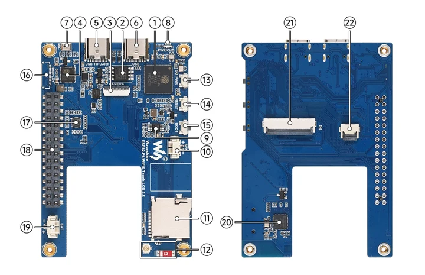
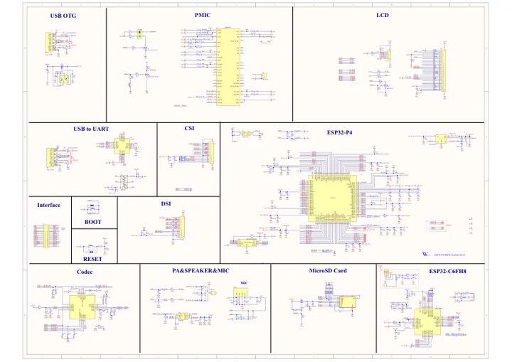

# ESP32-P4-WIFI6-Touch-LCD-3.5

**Waveshare** · ESP32-P4

Revision: Not identified

Coverage: Manufacturer references reviewed by scope; independent electrical and all-connector review pending

[Browse all manufacturers](../../../../BROWSE.md) · [Devices & IoT](../../../../DEVICES.md) · [Open in the browser guide](https://valleytech-black-wire-guide.pages.dev/?board=waveshare-esp32-esp32-p4-wifi6-touch-lcd-3-5)

## Datasheets and original documentation

Board datasheet: **not yet recorded**. Visual reference: **available**.

[Manufacturer hardware documentation](https://docs.waveshare.com/ESP32-P4-WIFI6-Touch-LCD-3.5)

- **schematic / board**: [ESP32-P4-WIFI6-Touch-LCD-3.5 Schematic Diagram](https://github.com/waveshareteam/ESP32-P4-WIFI6-Touch-LCD-3.5/raw/main/schematic/ESP32-P4-WIFI6-Touch-LCD-3.5-schematic.pdf) · [saved document](../../../../library/media/3d8b63f8f2a5a89d00c54eaf9798658f3147774e8d3383a1b0a96d5fb9c82d30.pdf)
- **hardware-guide / board**: [Manufacturer pin and hardware documentation](https://docs.waveshare.com/ESP32-P4-WIFI6-Touch-LCD-3.5) · online

A chip datasheet, schematic and board datasheet have different scopes. Match the exact hardware revision.

[Documentation coverage and remaining gaps](../../../../DOCUMENTATION.md)

## Hardware Description ​

**board labeling image** · Source identity and visual scope inspected; PDF review covers first-page preview. Independent electrical and all-connector completeness review pending. · JPG

[Open original reference](../../../../library/media/e736ba0886508b8ff262b862c42496c7bc8293ac8fc7be42a8a4494ae6c74798.jpg)

**Credit and rights:** Manufacturer artwork; reuse and print rights not established. Inclusion does not relicense the original.. Source/manufacturer: Waveshare.

[Source 1](https://docs.waveshare.com/assets/images/ESP32-P4-WIFI6-Touch-LCD-3.5-board-source-f699e74df34f1ef0c6cde1f23eaa249a.webp) · [Source 2](https://docs.waveshare.com/ESP32-P4-WIFI6-Touch-LCD-3.5)

Manufacturer source retained unchanged. Source identity and visual scope inspected; PDF review covers first-page preview. Independent electrical and all-connector completeness review pending. See the linked manufacturer page for the numbered component legend. This is not a complete physical pinout.

Image revision: As supplied in the original; match exact board revision

SHA-256: `e736ba0886508b8ff262b862c42496c7bc8293ac8fc7be42a8a4494ae6c74798`

## ESP32-P4-WIFI6-Touch-LCD-3.5 Schematic Diagram

**original reference PDF** · Source identity and visual scope inspected; PDF review covers first-page preview. Independent electrical and all-connector completeness review pending. · PDF

[Open original reference](../../../../library/media/3d8b63f8f2a5a89d00c54eaf9798658f3147774e8d3383a1b0a96d5fb9c82d30.pdf)

**Credit and rights:** Manufacturer artwork; reuse and print rights not established. Inclusion does not relicense the original.. Source/manufacturer: Waveshare.

[Source 1](https://github.com/waveshareteam/ESP32-P4-WIFI6-Touch-LCD-3.5/raw/main/schematic/ESP32-P4-WIFI6-Touch-LCD-3.5-schematic.pdf) · [Source 2](https://docs.waveshare.com/ESP32-P4-WIFI6-Touch-LCD-3.5/Resources-And-Documents)

Manufacturer source retained unchanged. Source identity and visual scope inspected; PDF review covers first-page preview. Independent electrical and all-connector completeness review pending.

Image revision: As supplied in the original; match exact board revision

SHA-256: `3d8b63f8f2a5a89d00c54eaf9798658f3147774e8d3383a1b0a96d5fb9c82d30`

Pin assignments have not been independently electrically verified. Check board revision before wiring.
