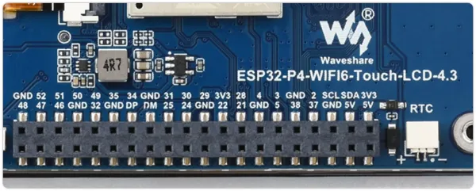

# ESP32-P4-WIFI6-Touch-LCD-4.3

**Waveshare** · ESP32-P4

Revision: Not identified  
Coverage: Pinout image collected

[Browse all manufacturers](../../../../BROWSE.md) · [Desktop app](https://github.com/valleytechsolutions/black-wire-desktop)

## Pinout

**pinout image** · Reviewed source · WEBP

[Open original reference](../../../../library/media/8b2cf78767e366727cbba2b03e35860a5df858d52474e1cc85da9ed9ac3ef1fe.webp)

**Credit and rights:** Not recorded; retain original attribution. Source/manufacturer: Waveshare.

[Source 1](https://docs.waveshare.com/assets/images/ESP32-P4-WIFI6-Touch-LCD-4.3-40PIN-silkscreen-b77024b2ec4bfa9577d2559906bfcf5e.webp) · [Source 2](https://docs.waveshare.com/ESP32-P4-WIFI6-Touch-LCD-4.3)

SHA-256: `8b2cf78767e366727cbba2b03e35860a5df858d52474e1cc85da9ed9ac3ef1fe`

Pin assignments have not been independently electrically verified. Check board revision before wiring.
