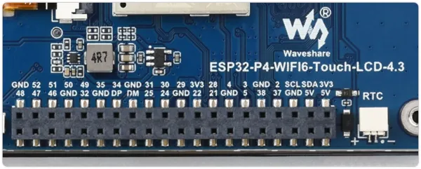

# ESP32-P4-WIFI6-Touch-LCD-4.3

**Waveshare** · ESP32-P4

Revision: Not identified

Coverage: Pinout image collected

[Browse all manufacturers](../../../../BROWSE.md) · [Devices & IoT](../../../../DEVICES.md) · [Open in the browser guide](https://valleytech-black-wire-guide.pages.dev/?board=waveshare-esp32-esp32-p4-wifi6-touch-lcd-4-3)

## Datasheets and original documentation

Board datasheet: **not yet recorded**. Visual reference: **available**.

[Manufacturer source (recorded link)](https://docs.waveshare.com/ESP32-P4-WIFI6-Touch-LCD-4.3)

A chip datasheet, schematic and board datasheet have different scopes. Match the exact hardware revision.

[Documentation coverage and remaining gaps](../../../../DOCUMENTATION.md)

## Pinout

**pinout image** · Reviewed source · WEBP

[Open original reference](../../../../library/media/8b2cf78767e366727cbba2b03e35860a5df858d52474e1cc85da9ed9ac3ef1fe.webp)

**Credit and rights:** Not recorded; retain original attribution. Source/manufacturer: Waveshare.

[Source 1](https://docs.waveshare.com/assets/images/ESP32-P4-WIFI6-Touch-LCD-4.3-40PIN-silkscreen-b77024b2ec4bfa9577d2559906bfcf5e.webp) · [Source 2](https://docs.waveshare.com/ESP32-P4-WIFI6-Touch-LCD-4.3)

Image revision: Not identified

SHA-256: `8b2cf78767e366727cbba2b03e35860a5df858d52474e1cc85da9ed9ac3ef1fe`

Pin assignments have not been independently electrically verified. Check board revision before wiring.
