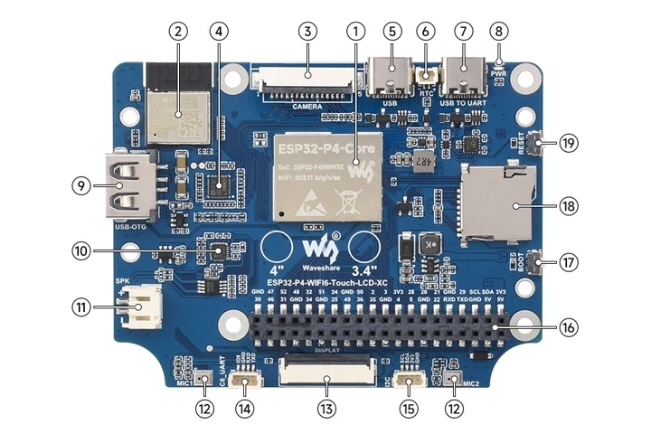
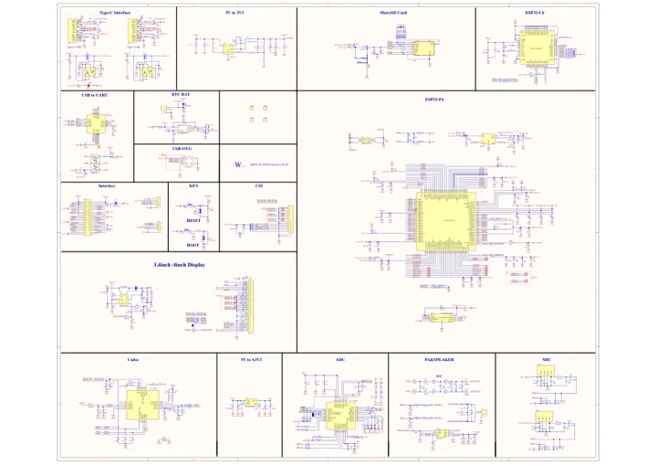

# ESP32-P4-WIFI6-Touch-LCD-4C

**Waveshare** · ESP32-P4

Revision: Not identified

Coverage: Manufacturer references reviewed by scope; independent electrical and all-connector review pending

[Browse all manufacturers](../../../../BROWSE.md) · [Devices & IoT](../../../../DEVICES.md) · [Open in the browser guide](https://valleytech-black-wire-guide.pages.dev/?board=waveshare-esp32-esp32-p4-wifi6-touch-lcd-4c)

## Datasheets and original documentation

Board datasheet: **not yet recorded**. Visual reference: **available**.

[Manufacturer hardware documentation](https://www.waveshare.com/wiki/ESP32-P4-WIFI6-Touch-LCD-4C)

- **schematic / recorded-source**: [ESP32-P4-WIFI6-Touch-LCD-XC Schematic](https://files.waveshare.com/wiki/ESP32-P4-WIFI6-Touch-LCD-XC/ESP32-P4-WIFI6-Touch-LCD-XC-Schematic.pdf) · [saved document](../../../../library/media/7a12998f1e641c49ab5e38f4765bdaf76aad2269e908e87ccffd572316647d68.pdf)
- **hardware-guide / board**: [Manufacturer pin and hardware documentation](https://www.waveshare.com/wiki/ESP32-P4-WIFI6-Touch-LCD-4C) · online

A chip datasheet, schematic and board datasheet have different scopes. Match the exact hardware revision.

[Documentation coverage and remaining gaps](../../../../DOCUMENTATION.md)

## Hardware Description

**board labeling image** · Source identity and visual scope inspected; PDF review covers first-page preview. Independent electrical and all-connector completeness review pending. · JPG

[Open original reference](../../../../library/media/89445dd0b056284b66407c570aecced4d4810754733455a4b939db4e99add840.jpg)

**Credit and rights:** Manufacturer artwork; reuse and print rights not established. Inclusion does not relicense the original.. Source/manufacturer: Waveshare.

[Source 1](https://www.waveshare.com/w/upload/3/31/ESP32-P4-WIFI6-Touch-LCD-4C-details-intro.jpg) · [Source 2](https://www.waveshare.com/wiki/ESP32-P4-WIFI6-Touch-LCD-4C)

Manufacturer source retained unchanged. Source identity and visual scope inspected; PDF review covers first-page preview. Independent electrical and all-connector completeness review pending. See the linked manufacturer page for the numbered component legend. This is not a complete physical pinout.

Image revision: As supplied in the original; match exact board revision

SHA-256: `89445dd0b056284b66407c570aecced4d4810754733455a4b939db4e99add840`

## ESP32-P4-WIFI6-Touch-LCD-XC Schematic

**original reference PDF** · Source identity and visual scope inspected; PDF review covers first-page preview. Independent electrical and all-connector completeness review pending. · PDF

[Open original reference](../../../../library/media/7a12998f1e641c49ab5e38f4765bdaf76aad2269e908e87ccffd572316647d68.pdf)

**Credit and rights:** Manufacturer artwork; reuse and print rights not established. Inclusion does not relicense the original.. Source/manufacturer: Waveshare.

[Source 1](https://files.waveshare.com/wiki/ESP32-P4-WIFI6-Touch-LCD-XC/ESP32-P4-WIFI6-Touch-LCD-XC-Schematic.pdf) · [Source 2](https://www.waveshare.com/wiki/ESP32-P4-WIFI6-Touch-LCD-4C)

Manufacturer source retained unchanged. Source identity and visual scope inspected; PDF review covers first-page preview. Independent electrical and all-connector completeness review pending.

Image revision: As supplied in the original; match exact board revision

SHA-256: `7a12998f1e641c49ab5e38f4765bdaf76aad2269e908e87ccffd572316647d68`

Pin assignments have not been independently electrically verified. Check board revision before wiring.
