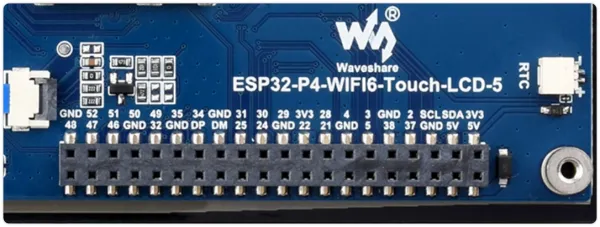

# ESP32-P4-WIFI6-Touch-LCD-5

**Waveshare** · ESP32-P4

Revision: Not identified  
Coverage: Pinout image collected

[Browse all manufacturers](../../../../BROWSE.md) · [Desktop app](https://github.com/valleytechsolutions/black-wire-desktop)

## Pinout

**pinout image** · Reviewed source · WEBP

[Open original reference](../../../../library/media/1274860f82b39527287bb5c4166f1082478b30cc506ba532cc12d5811eaad0d5.webp)

**Credit and rights:** Not recorded; retain original attribution. Source/manufacturer: Waveshare.

[Source 1](https://docs.waveshare.com/assets/images/ESP32-P4-WIFI6-Touch-LCD-5-40PIN-silkscreen-bf4f457278af9477dc55cd2e99d6fb71.webp) · [Source 2](https://docs.waveshare.com/ESP32-P4-WIFI6-Touch-LCD-5)

SHA-256: `1274860f82b39527287bb5c4166f1082478b30cc506ba532cc12d5811eaad0d5`

Pin assignments have not been independently electrically verified. Check board revision before wiring.
