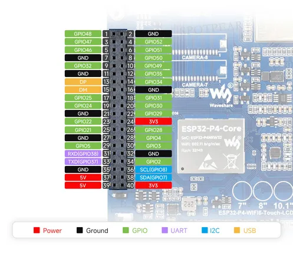

# ESP32-P4-WIFI6-Touch-LCD (shared 7-8-10.1 reference)

**Waveshare** · ESP32-P4

Revision: Not identified  
Coverage: Partial pinout collected; full reference still needed

[Browse all manufacturers](../../../../BROWSE.md) · [Desktop app](https://github.com/valleytechsolutions/black-wire-desktop)

## Pinout - Spotpear source

**pinout image** · Reviewed source · JPG

[Open original reference](../../../../library/media/3afe3696b102f0a69ec18815a83e7bbeea7381559191452f7212e0592925dcf2.jpg)

**Credit and rights:** Not established; source attribution retained. Source/manufacturer: Waveshare.

[Source 1](https://cdn.static.spotpear.com/uploads/picture/product/esp32/ESP32-P4-WIFI6-Touch-LCD-7/ESP32-P4-WIFI6-Touch-LCD-7-details-16.jpg) · [Source 2](https://spotpear.com/shop/ESP32-P4-7-inch-LCD-Display-TouchScreen-WIFI6/ESP32-P4-WIFI6-Touch-LCD-10.1.html) · [Source 3](https://spotpear.com/shop/ESP32-P4-7-inch-LCD-Display-TouchScreen-WIFI6/ESP32-P4-WIFI6-Touch-LCD-7-EN.html) · [Source 4](https://spotpear.com/shop/ESP32-P4-7-inch-LCD-Display-TouchScreen-WIFI6/ESP32-P4-WIFI6-Touch-LCD-10.1-EN.html) · [Source 5](https://spotpear.com/shop/ESP32-P4-7-inch-LCD-Display-TouchScreen-WIFI6/ESP32-P4-WIFI6-Touch-LCD-8.html) · [Source 6](https://spotpear.com/shop/ESP32-P4-7-inch-LCD-Display-TouchScreen-WIFI6/ESP32-P4-WIFI6-Touch-LCD-8-EN.html) · [Source 7](https://spotpear.com/shop/ESP32-P4-7-inch-LCD-Display-TouchScreen-WIFI6/ESP32-P4-WIFI6-Touch-LCD-7.html)

Source image saved from Spotpear. Manufacturer matched using visible branding, model and existing manufacturer documentation. Seller presents this picture for a display-size family. The depicted PCB reads 10.1; other sizes/revisions remain unverified.

**Partial diagram. Confirm missing pins against the exact board documentation.**

SHA-256: `3afe3696b102f0a69ec18815a83e7bbeea7381559191452f7212e0592925dcf2`

Pin assignments have not been independently electrically verified. Check board revision before wiring.
