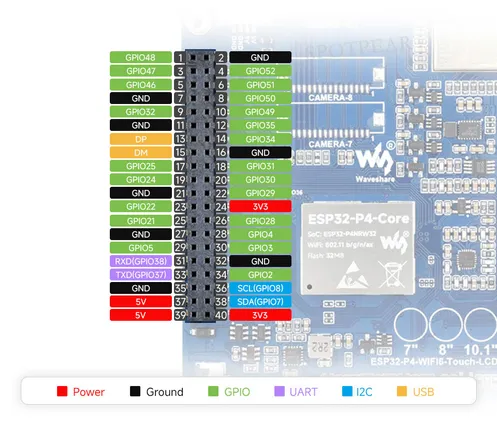

# ESP32-P4-WIFI6-Touch-LCD (shared 7-8-10.1 reference)

**Waveshare** · ESP32-P4

Revision: Not identified

Coverage: Partial pinout collected; full reference still needed

[Browse all manufacturers](../../../../BROWSE.md) · [Devices & IoT](../../../../DEVICES.md) · [Open in the browser guide](https://valleytech-black-wire-guide.pages.dev/?board=waveshare-esp32-esp32-p4-wifi6-touch-lcd-shared-7-8-10-1-reference)

## Datasheets and original documentation

Board datasheet: **not yet recorded**. Visual reference: **available**.

Original manufacturer website still needs identification.

A chip datasheet, schematic and board datasheet have different scopes. Match the exact hardware revision.

[Documentation coverage and remaining gaps](../../../../DOCUMENTATION.md)

## Pinout - Spotpear source

**pinout image** · Reviewed source · JPG

[Open original reference](../../../../library/media/3afe3696b102f0a69ec18815a83e7bbeea7381559191452f7212e0592925dcf2.jpg)

**Credit and rights:** Not established; source attribution retained. Source/manufacturer: Waveshare.

[Source 1](https://cdn.static.spotpear.com/uploads/picture/product/esp32/ESP32-P4-WIFI6-Touch-LCD-7/ESP32-P4-WIFI6-Touch-LCD-7-details-16.jpg) · [Source 2](https://spotpear.com/shop/ESP32-P4-7-inch-LCD-Display-TouchScreen-WIFI6/ESP32-P4-WIFI6-Touch-LCD-10.1.html) · [Source 3](https://spotpear.com/shop/ESP32-P4-7-inch-LCD-Display-TouchScreen-WIFI6/ESP32-P4-WIFI6-Touch-LCD-7-EN.html) · [Source 4](https://spotpear.com/shop/ESP32-P4-7-inch-LCD-Display-TouchScreen-WIFI6/ESP32-P4-WIFI6-Touch-LCD-10.1-EN.html) · [Source 5](https://spotpear.com/shop/ESP32-P4-7-inch-LCD-Display-TouchScreen-WIFI6/ESP32-P4-WIFI6-Touch-LCD-8.html) · [Source 6](https://spotpear.com/shop/ESP32-P4-7-inch-LCD-Display-TouchScreen-WIFI6/ESP32-P4-WIFI6-Touch-LCD-8-EN.html) · [Source 7](https://spotpear.com/shop/ESP32-P4-7-inch-LCD-Display-TouchScreen-WIFI6/ESP32-P4-WIFI6-Touch-LCD-7.html)

Source image saved from Spotpear. Manufacturer matched using visible branding, model and existing manufacturer documentation. Seller presents this picture for a display-size family. The depicted PCB reads 10.1; other sizes/revisions remain unverified.

Image revision: Not identified

SHA-256: `3afe3696b102f0a69ec18815a83e7bbeea7381559191452f7212e0592925dcf2`

Pin assignments have not been independently electrically verified. Check board revision before wiring.
