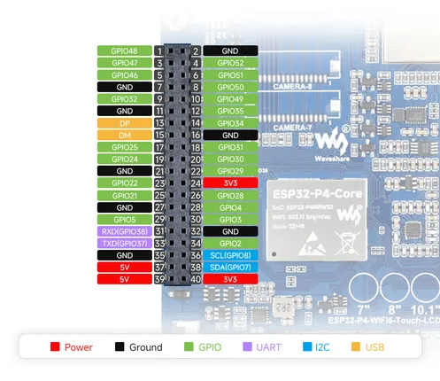
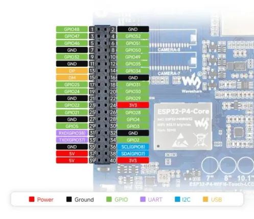

# ESP32-P4-WIFI6-Touch-LCD-X

**Waveshare** · ESP32-P4

Revision: Not identified  
Coverage: Pinout image collected

[Browse all manufacturers](../../../../BROWSE.md) · [Desktop app](https://github.com/valleytechsolutions/black-wire-desktop)

## Pinout

**pinout image** · Reviewed source · JPG

[Open original reference](../../../../library/media/6b1018b646623051bff865c96cff3b1b5ba7592ba304d33349e2f25ddb823086.jpg)

**Credit and rights:** Not recorded; retain original attribution. Source/manufacturer: Waveshare.

[Source 1](https://www.waveshare.com/img/devkit/ESP32-P4-WIFI6-Touch-LCD-7/ESP32-P4-WIFI6-Touch-LCD-7-details-intro-1.jpg) · [Source 2](https://www.waveshare.com/esp32-p4-wifi6-touch-lcd-7-8-10.1.htm)

SHA-256: `6b1018b646623051bff865c96cff3b1b5ba7592ba304d33349e2f25ddb823086`

## Pinout

**pinout image** · Reviewed source · WEBP

[Open original reference](../../../../library/media/1b35361f28847a2a5ba0f91efae5b5d6c649bb3e17bb6e5e54dc6f836db1261f.webp)

**Credit and rights:** Not recorded; retain original attribution. Source/manufacturer: Waveshare.

[Source 1](https://docs.waveshare.com/assets/images/ESP32-P4-WIFI6-Touch-LCD-7-details-intro-1-d402e8f1bc04b00593246eca93018d6d.webp) · [Source 2](https://docs.waveshare.com/ESP32-P4-WIFI6-Touch-LCD-X)

SHA-256: `1b35361f28847a2a5ba0f91efae5b5d6c649bb3e17bb6e5e54dc6f836db1261f`

Pin assignments have not been independently electrically verified. Check board revision before wiring.
