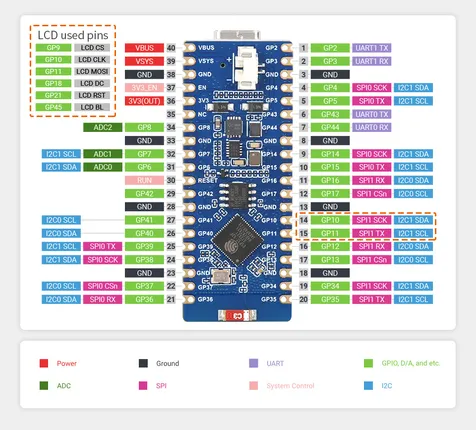
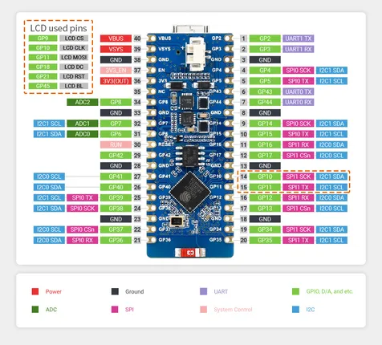

# ESP32-S2-LCD-0.96

**Waveshare** · ESP32-S2

Revision: Not identified

Coverage: Pinout image collected

[Browse all manufacturers](../../../../BROWSE.md) · [Devices & IoT](../../../../DEVICES.md) · [Open in the browser guide](https://valleytech-black-wire-guide.pages.dev/?board=waveshare-esp32-esp32-s2-lcd-0-96)

## Datasheets and original documentation

Board datasheet: **not yet recorded**. Visual reference: **available**.

[Manufacturer source (recorded link)](https://www.waveshare.com/esp32-s2.htm)

A chip datasheet, schematic and board datasheet have different scopes. Match the exact hardware revision.

[Documentation coverage and remaining gaps](../../../../DOCUMENTATION.md)

## Pinout

**pinout image** · Reviewed source · JPG

[Open original reference](../../../../library/media/afcf94df031dccc2b6bf4252dba10d096c57fc77139c1df0f71f3b2f6b12c868.jpg)

**Credit and rights:** Not recorded; retain original attribution. Source/manufacturer: Waveshare.

[Source 1](https://www.waveshare.com/img/devkit/ESP32-S2-Pico/ESP32-S2-Pico-details-9-2.jpg) · [Source 2](https://www.waveshare.com/esp32-s2.htm)

Image revision: Not identified

SHA-256: `afcf94df031dccc2b6bf4252dba10d096c57fc77139c1df0f71f3b2f6b12c868`

## Pinout

**pinout image** · Reviewed source · JPG

[Open original reference](../../../../library/media/7016cbfe7c776042fbaf9ba99bd88ad86779f2ada8edcb6fa3378daeb4633eaa.jpg)

**Credit and rights:** Not recorded; retain original attribution. Source/manufacturer: Waveshare.

[Source 1](https://www.waveshare.com/w/upload/9/98/ESP32-S2-Pico-details-9-2.jpg) · [Source 2](https://www.waveshare.com/wiki/ESP32-S2-LCD-0.96) · [Source 3](https://www.waveshare.com/wiki/ESP32-S2-Pico)

Image revision: Not identified

SHA-256: `7016cbfe7c776042fbaf9ba99bd88ad86779f2ada8edcb6fa3378daeb4633eaa`

Pin assignments have not been independently electrically verified. Check board revision before wiring.
