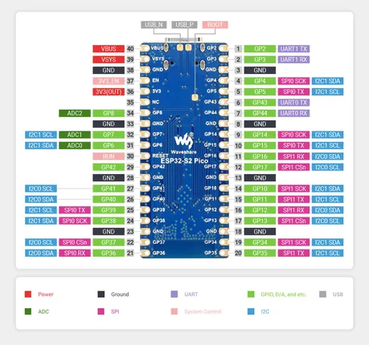

# ESP32-S2-Pico

**Waveshare** · ESP32-S2

Revision: Not identified  
Coverage: Pinout image collected

[Browse all manufacturers](../../../../BROWSE.md) · [Desktop app](https://github.com/valleytechsolutions/black-wire-desktop)

## Pinout

**pinout image** · Reviewed source · JPG

[Open original reference](../../../../library/media/8daef0cee4cdb8120f87c0430b0f11d8c7e0696868e4bcf877558603e605f2d0.jpg)

**Credit and rights:** Not recorded; retain original attribution. Source/manufacturer: Waveshare.

[Source 1](https://www.waveshare.com/img/devkit/ESP32-S2-Pico/ESP32-S2-Pico-details-9-1.jpg) · [Source 2](https://www.waveshare.com/esp32-s2.htm)

SHA-256: `8daef0cee4cdb8120f87c0430b0f11d8c7e0696868e4bcf877558603e605f2d0`

## Pinout

**pinout image** · Reviewed source · JPG

[Open original reference](../../../../library/media/9de31f532fc7dccdbddb7fb200bfa865b3d36fa5a0576b43a1d61b3227d396aa.jpg)

**Credit and rights:** Not recorded; retain original attribution. Source/manufacturer: Waveshare.

[Source 1](https://www.waveshare.com/w/upload/0/05/ESP32-S2-Pico-details-9-1.jpg) · [Source 2](https://www.waveshare.com/wiki/ESP32-S2-LCD-0.96) · [Source 3](https://www.waveshare.com/wiki/ESP32-S2-Pico)

SHA-256: `9de31f532fc7dccdbddb7fb200bfa865b3d36fa5a0576b43a1d61b3227d396aa`

Pin assignments have not been independently electrically verified. Check board revision before wiring.
