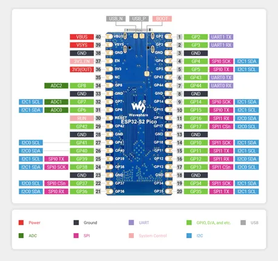
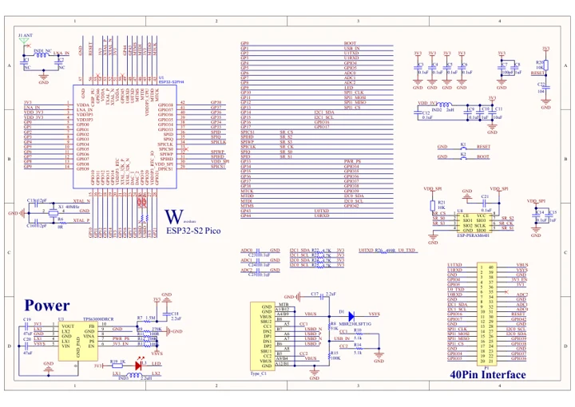

# ESP32-S2-Pico with LCD

**Waveshare** · ESP32-S2

Revision: Not identified

Coverage: Manufacturer references reviewed by scope; independent electrical and all-connector review pending

[Browse all manufacturers](../../../../BROWSE.md) · [Devices & IoT](../../../../DEVICES.md) · [Open in the browser guide](https://valleytech-black-wire-guide.pages.dev/?board=waveshare-esp32-esp32-s2-pico-with-lcd)

## Datasheets and original documentation

Board datasheet: **not yet recorded**. Visual reference: **available**.

[Manufacturer hardware documentation](https://www.waveshare.com/wiki/ESP32-S2-Pico)

- **schematic / recorded-source**: [ESP32-S2-Pico Schematic](https://files.waveshare.com/upload/3/35/ESP32-S2-Pico_Sch.pdf) · [saved document](../../../../library/media/2bf2b17f4ed477b297cfff3176541cb9355f8122777f3d17f897a70fdf35a906.pdf)
- **hardware-guide / board**: [Manufacturer pin and hardware documentation](https://www.waveshare.com/wiki/ESP32-S2-Pico) · online

A chip datasheet, schematic and board datasheet have different scopes. Match the exact hardware revision.

[Documentation coverage and remaining gaps](../../../../DOCUMENTATION.md)

## Pinout

**pinout image** · Source identity and visual scope inspected; PDF review covers first-page preview. Independent electrical and all-connector completeness review pending. · JPG

[Open original reference](../../../../library/media/9de31f532fc7dccdbddb7fb200bfa865b3d36fa5a0576b43a1d61b3227d396aa.jpg)

**Credit and rights:** Manufacturer artwork; reuse and print rights not established. Inclusion does not relicense the original.. Source/manufacturer: Waveshare.

[Source 1](https://www.waveshare.com/w/upload/0/05/ESP32-S2-Pico-details-9-1.jpg) · [Source 2](https://www.waveshare.com/wiki/ESP32-S2-Pico)

Manufacturer source retained unchanged. Source identity and visual scope inspected; PDF review covers first-page preview. Independent electrical and all-connector completeness review pending.

Image revision: As supplied in the original; match exact board revision

SHA-256: `9de31f532fc7dccdbddb7fb200bfa865b3d36fa5a0576b43a1d61b3227d396aa`

## ESP32-S2-Pico Schematic

**original reference PDF** · Source identity and visual scope inspected; PDF review covers first-page preview. Independent electrical and all-connector completeness review pending. · PDF

[Open original reference](../../../../library/media/2bf2b17f4ed477b297cfff3176541cb9355f8122777f3d17f897a70fdf35a906.pdf)

**Credit and rights:** Manufacturer artwork; reuse and print rights not established. Inclusion does not relicense the original.. Source/manufacturer: Waveshare.

[Source 1](https://files.waveshare.com/upload/3/35/ESP32-S2-Pico_Sch.pdf) · [Source 2](https://www.waveshare.com/wiki/ESP32-S2-Pico)

Manufacturer source retained unchanged. Source identity and visual scope inspected; PDF review covers first-page preview. Independent electrical and all-connector completeness review pending.

Image revision: As supplied in the original; match exact board revision

SHA-256: `2bf2b17f4ed477b297cfff3176541cb9355f8122777f3d17f897a70fdf35a906`

Pin assignments have not been independently electrically verified. Check board revision before wiring.
