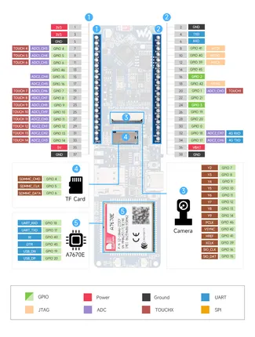

# ESP32-S3-A7670E-4G

**Waveshare** · ESP32-S3

Revision: Not identified

Coverage: Pinout image collected

[Browse all manufacturers](../../../../BROWSE.md) · [Devices & IoT](../../../../DEVICES.md) · [Open in the browser guide](https://valleytech-black-wire-guide.pages.dev/?board=waveshare-esp32-esp32-s3-a7670e-4g)

## Datasheets and original documentation

Board datasheet: **not yet recorded**. Visual reference: **available**.

[Manufacturer source (recorded link)](https://www.waveshare.com/esp32-s3-a7670e-4g.htm)

A chip datasheet, schematic and board datasheet have different scopes. Match the exact hardware revision.

[Documentation coverage and remaining gaps](../../../../DOCUMENTATION.md)

## Pinout

**pinout image** · Reviewed source · JPG

[Open original reference](../../../../library/media/bfef0d207555deeb0dbac72e0fd948adf59012e061a679d5511a6a9642d7818a.jpg)

**Credit and rights:** Not recorded; retain original attribution. Source/manufacturer: Waveshare.

[Source 1](https://www.waveshare.com/img/devkit/ESP32-S3-A7670E-4G/ESP32-S3-A7670E-4G-details-inter.jpg) · [Source 2](https://www.waveshare.com/esp32-s3-a7670e-4g.htm)

Image revision: Not identified

SHA-256: `bfef0d207555deeb0dbac72e0fd948adf59012e061a679d5511a6a9642d7818a`

Pin assignments have not been independently electrically verified. Check board revision before wiring.
