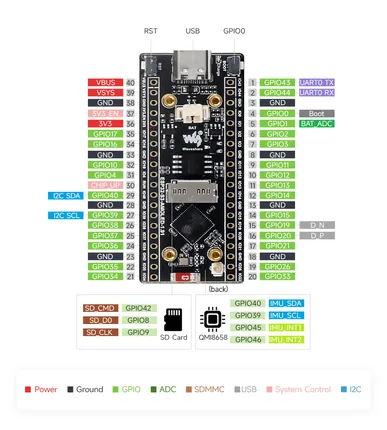
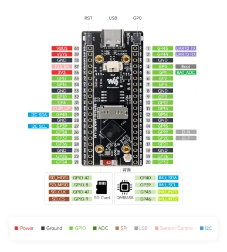

# ESP32-S3-AMOLED-1.91

**Waveshare** · ESP32-S3

Revision: Not identified  
Coverage: Pinout image collected

[Browse all manufacturers](../../../../BROWSE.md) · [Desktop app](https://github.com/valleytechsolutions/black-wire-desktop)

## Pinout

**pinout image** · Reviewed source · JPG

[Open original reference](../../../../library/media/359160149cfbd55333f77212adede2a300dfcc474e6ed67defcd298255a18394.jpg)

**Credit and rights:** Not recorded; retain original attribution. Source/manufacturer: Waveshare.

[Source 1](https://www.waveshare.com/img/devkit/ESP32-S3-Touch-AMOLED-1.91/ESP32-S3-Touch-AMOLED-1.91-details-inter.jpg) · [Source 2](https://www.waveshare.com/esp32-s3-amoled-1.91.htm)

SHA-256: `359160149cfbd55333f77212adede2a300dfcc474e6ed67defcd298255a18394`

## Pinout

**pinout image** · Reviewed source · WEBP

[Open original reference](../../../../library/media/1d4ba4dfaf474a171d0ccfaaa61d42b5338fa36f2ecb9145bd5034e8fd848e23.webp)

**Credit and rights:** Not recorded; retain original attribution. Source/manufacturer: Waveshare.

[Source 1](https://docs.waveshare.com/assets/images/ESP32-S3-AMOLED-1.91-IntfIntro-1-346a608040ccb7f851b5fde0b1bb34a4.webp) · [Source 2](https://docs.waveshare.com/ESP32-S3-AMOLED-1.91)

SHA-256: `1d4ba4dfaf474a171d0ccfaaa61d42b5338fa36f2ecb9145bd5034e8fd848e23`

Pin assignments have not been independently electrically verified. Check board revision before wiring.
