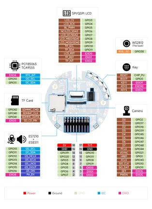
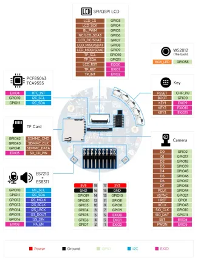
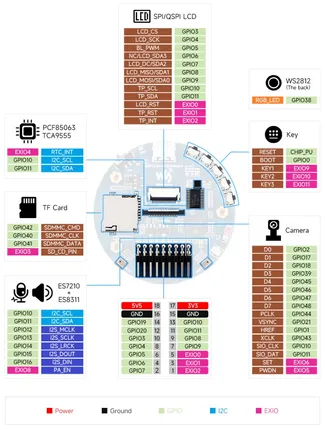

# ESP32-S3-AUDIO-Board

**Waveshare** · ESP32-S3

Revision: Not identified  
Coverage: Pinout image collected

[Browse all manufacturers](../../../../BROWSE.md) · [Desktop app](https://github.com/valleytechsolutions/black-wire-desktop)

## Pinout

**pinout image** · Reviewed source · JPG

[Open original reference](../../../../library/media/ee9654fff77abf30975b14503b34daf817ad9c76d0c15d09a33c88772a68c335.jpg)

**Credit and rights:** Not recorded; retain original attribution. Source/manufacturer: Waveshare.

[Source 1](https://www.waveshare.com/img/devkit/ESP32-S3-AUDIO-Board/ESP32-S3-AUDIO-Board-details-inter.jpg) · [Source 2](https://www.waveshare.com/esp32-s3-audio-board.htm)

SHA-256: `ee9654fff77abf30975b14503b34daf817ad9c76d0c15d09a33c88772a68c335`

## Pinout

**pinout image** · Reviewed source · WEBP

[Open original reference](../../../../library/media/5862efe903fa2a3218c7282986f4d8d2f958dfdc9bd19d4946d7df2d22e53167.webp)

**Credit and rights:** Not recorded; retain original attribution. Source/manufacturer: Waveshare.

[Source 1](https://docs.waveshare.com/assets/images/Esp32s3_audio_boarddetails-inter-1.1-b330d016d3bccfbfea585aaf6c95600c.webp) · [Source 2](https://docs.waveshare.com/ESP32-S3-AUDIO-Board)

SHA-256: `5862efe903fa2a3218c7282986f4d8d2f958dfdc9bd19d4946d7df2d22e53167`

## Pinout

**pinout image** · Reviewed source · JPG

[Open original reference](../../../../library/media/59d761bd08822c57de76293563e2abb6d5a662bbc2254347deae70b84107e0f9.jpg)

**Credit and rights:** Not recorded; retain original attribution. Source/manufacturer: Waveshare.

[Source 1](https://www.waveshare.com/w/upload/7/73/Esp32s3_audio_boarddetails-inter-1.1.jpg) · [Source 2](https://www.waveshare.com/wiki/ESP32-S3-AUDIO-Board)

SHA-256: `59d761bd08822c57de76293563e2abb6d5a662bbc2254347deae70b84107e0f9`

Pin assignments have not been independently electrically verified. Check board revision before wiring.
