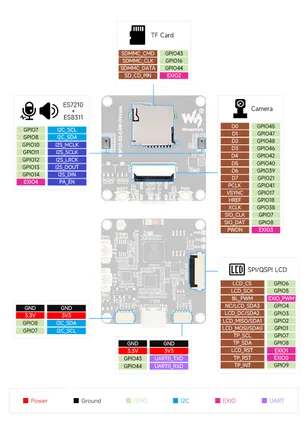

# ESP32-S3-CAM-OVxxxx

**Waveshare** · ESP32-S3

Revision: Not identified  
Coverage: Pinout image collected

[Browse all manufacturers](../../../../BROWSE.md) · [Desktop app](https://github.com/valleytechsolutions/black-wire-desktop)

## Pinout

**pinout image** · Reviewed source · JPG

[Open original reference](../../../../library/media/453863863741b243a1dc41b22e96dcb22bd287b25125323c7f335b9f712fe70a.jpg)

**Credit and rights:** Not recorded; retain original attribution. Source/manufacturer: Waveshare.

[Source 1](https://www.waveshare.com/img/devkit/ESP32-S3-CAM-OVxxxx/ESP32-S3-CAM-OVxxxx-details-inter.jpg) · [Source 2](https://www.waveshare.com/esp32-s3-cam-ov5640.htm)

SHA-256: `453863863741b243a1dc41b22e96dcb22bd287b25125323c7f335b9f712fe70a`

Pin assignments have not been independently electrically verified. Check board revision before wiring.
