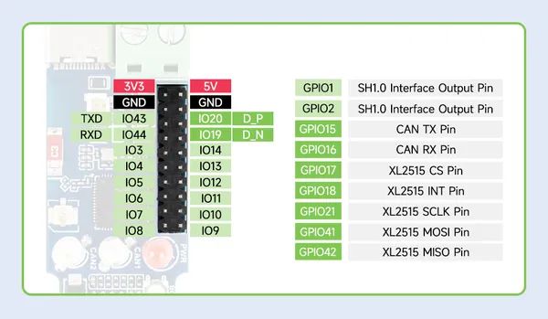
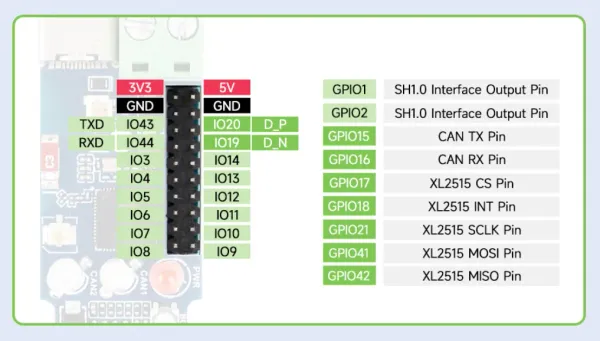

# ESP32-S3-CAN-2CH

**Waveshare** · ESP32-S3

Revision: Not identified  
Coverage: Pinout image collected

[Browse all manufacturers](../../../../BROWSE.md) · [Desktop app](https://github.com/valleytechsolutions/black-wire-desktop)

## Pinout

**pinout image** · Reviewed source · JPG

[Open original reference](../../../../library/media/934cc5fac8c0d3c7dee973d0c92b055fcc3f724b25ad98f01b9851a83d35afc8.jpg)

**Credit and rights:** Not recorded; retain original attribution. Source/manufacturer: Waveshare.

[Source 1](https://www.waveshare.com/img/devkit/accBoard/ESP32-S3-CAN-2CH/ESP32-S3-CAN-2CH-details-15.jpg) · [Source 2](https://www.waveshare.com/esp32-s3-can-2ch.htm)

SHA-256: `934cc5fac8c0d3c7dee973d0c92b055fcc3f724b25ad98f01b9851a83d35afc8`

## Pinout

**pinout image** · Reviewed source · WEBP

[Open original reference](../../../../library/media/6f50a97d8b7b49b3d428f39c4668f568541759b7b32f7e2cc64c2212cce9e27a.webp)

**Credit and rights:** Not recorded; retain original attribution. Source/manufacturer: Waveshare.

[Source 1](https://docs.waveshare.com/assets/images/ESP32-S3-CAN-2CH-details-15-e1965af6facfd0a6bb5b953bbd74d45d.webp) · [Source 2](https://docs.waveshare.com/ESP32-S3-CAN-2CH)

SHA-256: `6f50a97d8b7b49b3d428f39c4668f568541759b7b32f7e2cc64c2212cce9e27a`

Pin assignments have not been independently electrically verified. Check board revision before wiring.
