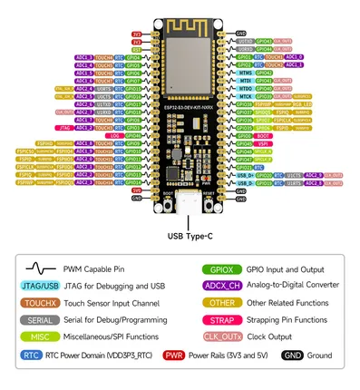
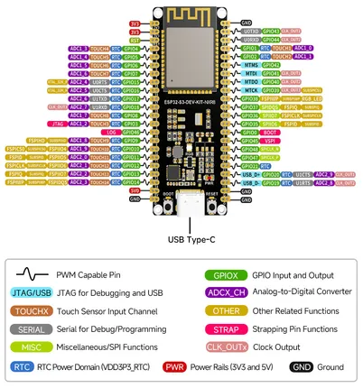
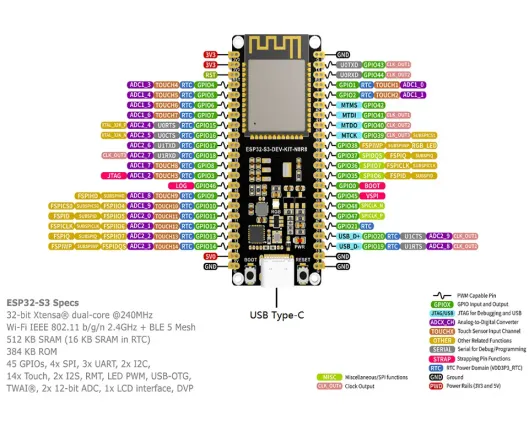

# ESP32-S3-DEV-KIT-N8R8

**Waveshare** · ESP32-S3

Revision: Not identified  
Coverage: Pinout image collected

[Browse all manufacturers](../../../../BROWSE.md) · [Desktop app](https://github.com/valleytechsolutions/black-wire-desktop)

## Pinout

**pinout image** · Reviewed source · JPG

[Open original reference](../../../../library/media/c9fc91695237142b1161e77c8c7d98552cf04fbe4249a43d570d90b71d363965.jpg)

**Credit and rights:** Not recorded; retain original attribution. Source/manufacturer: Waveshare.

[Source 1](https://www.waveshare.com/img/devkit/ESP32-S3-DEV-KIT-N8R8/ESP32-S3-DEV-KIT-N8R8-details-13.jpg) · [Source 2](https://www.waveshare.com/esp32-s3-dev-kit-n8r8.htm)

SHA-256: `c9fc91695237142b1161e77c8c7d98552cf04fbe4249a43d570d90b71d363965`

## Pinout

**pinout image** · Reviewed source · PNG

[Open original reference](../../../../library/media/6f3faf62b22a0a675de5fb4a566609c58a0ec76ac2a485c92fe6a46825777cd3.png)

**Credit and rights:** Not recorded; retain original attribution. Source/manufacturer: Waveshare.

[Source 1](https://www.waveshare.com/w/upload/c/c6/ESP32-S3-DEV-KIT-N8R8-details-13.png) · [Source 2](https://www.waveshare.com/wiki/ESP32-S3-DEV-KIT-N8R8)

SHA-256: `6f3faf62b22a0a675de5fb4a566609c58a0ec76ac2a485c92fe6a46825777cd3`

## Pinout

**pinout image** · Reviewed source · WEBP

[Open original reference](../../../../library/media/3f0e168281bed7f365d2dfb657500d92ee134c6f322b5376e97dac5519c27ab7.webp)

**Credit and rights:** Not recorded; retain original attribution. Source/manufacturer: Waveshare.

[Source 1](https://docs.waveshare.com/assets/images/ESP32-S3-DEV-KIT-N8R8-details-13-d6828c78fd0babb4a15b7ebb6b6872ff.webp) · [Source 2](https://docs.waveshare.com/ESP32-S3-DEV-KIT-N8R8)

SHA-256: `3f0e168281bed7f365d2dfb657500d92ee134c6f322b5376e97dac5519c27ab7`

Pin assignments have not been independently electrically verified. Check board revision before wiring.
