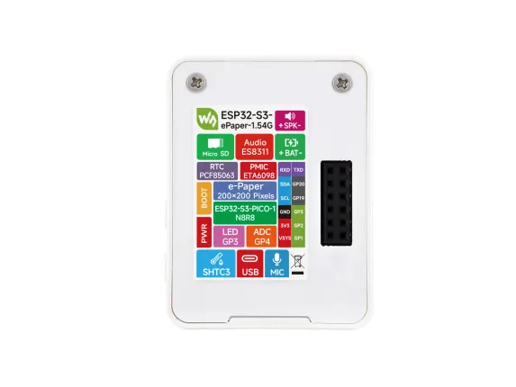

# ESP32-S3-ePaper-1.54G

**Waveshare** · ESP32-S3

Revision: Not identified  
Coverage: Pinout image collected

[Browse all manufacturers](../../../../BROWSE.md) · [Desktop app](https://github.com/valleytechsolutions/black-wire-desktop)

## Pinout

**pinout image** · Reviewed source · WEBP

[Open original reference](../../../../library/media/eaf21d4f551a84daba3f3636fc0c73306cc60ddb7e34507ee9e00a2e1bddb024.webp)

**Credit and rights:** Not recorded; retain original attribution. Source/manufacturer: Waveshare.

[Source 1](https://docs.waveshare.com/assets/images/ESP32-S3-ePaper-1.54G-Pinout-7a8a2d15b7c5400595ce260e4b31198a.webp) · [Source 2](https://docs.waveshare.com/ESP32-S3-ePaper-1.54G)

SHA-256: `eaf21d4f551a84daba3f3636fc0c73306cc60ddb7e34507ee9e00a2e1bddb024`

Pin assignments have not been independently electrically verified. Check board revision before wiring.
