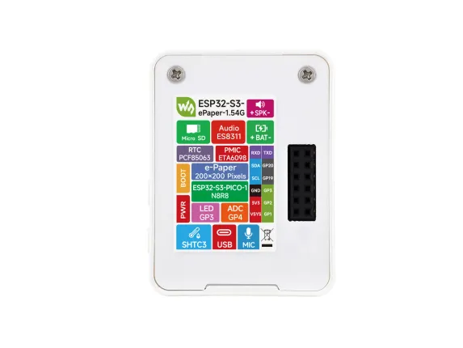

# ESP32-S3-ePaper-1.54G

**Waveshare** · ESP32-S3

Revision: Not identified

Coverage: Pinout image collected

[Browse all manufacturers](../../../../BROWSE.md) · [Devices & IoT](../../../../DEVICES.md) · [Open in the browser guide](https://valleytech-black-wire-guide.pages.dev/?board=waveshare-esp32-esp32-s3-epaper-1-54g)

## Datasheets and original documentation

Board datasheet: **not yet recorded**. Visual reference: **available**.

[Manufacturer source (recorded link)](https://docs.waveshare.com/ESP32-S3-ePaper-1.54G)

A chip datasheet, schematic and board datasheet have different scopes. Match the exact hardware revision.

[Documentation coverage and remaining gaps](../../../../DOCUMENTATION.md)

## Pinout

**pinout image** · Reviewed source · WEBP

[Open original reference](../../../../library/media/eaf21d4f551a84daba3f3636fc0c73306cc60ddb7e34507ee9e00a2e1bddb024.webp)

**Credit and rights:** Not recorded; retain original attribution. Source/manufacturer: Waveshare.

[Source 1](https://docs.waveshare.com/assets/images/ESP32-S3-ePaper-1.54G-Pinout-7a8a2d15b7c5400595ce260e4b31198a.webp) · [Source 2](https://docs.waveshare.com/ESP32-S3-ePaper-1.54G)

Image revision: Not identified

SHA-256: `eaf21d4f551a84daba3f3636fc0c73306cc60ddb7e34507ee9e00a2e1bddb024`

Pin assignments have not been independently electrically verified. Check board revision before wiring.
