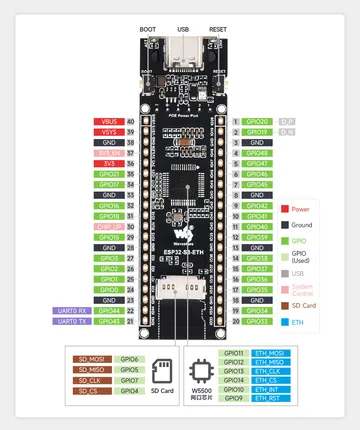
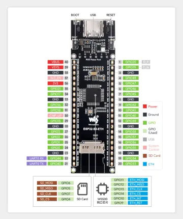
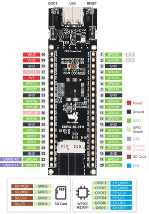

# ESP32-S3-ETH

**Waveshare** · ESP32-S3

Revision: Not identified  
Coverage: Pinout image collected

[Browse all manufacturers](../../../../BROWSE.md) · [Desktop app](https://github.com/valleytechsolutions/black-wire-desktop)

## Pinout

**pinout image** · Reviewed source · JPG

[Open original reference](../../../../library/media/09a5a0538d09f997ceac1af2cd4fe3f8804c03cf7e1ba3656d5fdc5ddae19053.jpg)

**Credit and rights:** Not recorded; retain original attribution. Source/manufacturer: Waveshare.

[Source 1](https://www.waveshare.com/img/devkit/ESP32-S3-ETH/ESP32-S3-ETH-details-15.jpg) · [Source 2](https://www.waveshare.com/esp32-s3-eth.htm)

SHA-256: `09a5a0538d09f997ceac1af2cd4fe3f8804c03cf7e1ba3656d5fdc5ddae19053`

## Pinout

**pinout image** · Reviewed source · WEBP

[Open original reference](../../../../library/media/4119a158cac43190b467c07648e07c6e76bdf65afb28f3833293926ae406a1d0.webp)

**Credit and rights:** Not recorded; retain original attribution. Source/manufacturer: Waveshare.

[Source 1](https://docs.waveshare.com/assets/images/ESP32-S3-ETH-details-15-b9d2e97a5122db37da6be5bac19e29b4.webp) · [Source 2](https://docs.waveshare.com/ESP32-S3-ETH)

SHA-256: `4119a158cac43190b467c07648e07c6e76bdf65afb28f3833293926ae406a1d0`

## Pinout

**pinout image** · Reviewed source · PNG

[Open original reference](../../../../library/media/e88f5bafcb3dfcfc80207c61897530369686deb67c70ee628e2424594daba1ae.png)

**Credit and rights:** Not recorded; retain original attribution. Source/manufacturer: Waveshare.

[Source 1](https://www.waveshare.com/w/upload/6/69/ESP32-S3-ETH-details-15.png) · [Source 2](https://www.waveshare.com/wiki/ESP32-S3-ETH)

SHA-256: `e88f5bafcb3dfcfc80207c61897530369686deb67c70ee628e2424594daba1ae`

Pin assignments have not been independently electrically verified. Check board revision before wiring.
