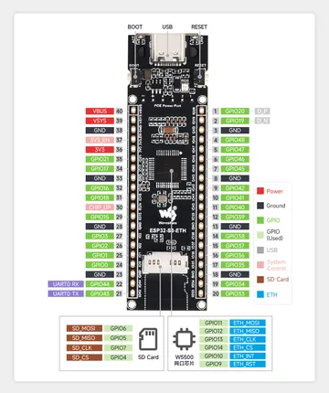
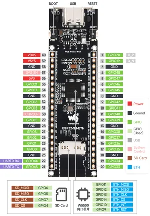

# ESP32-S3-ETH

**Waveshare** · ESP32-S3

Revision: Not identified

Coverage: Manufacturer references reviewed by scope; independent electrical and all-connector review pending

[Browse all manufacturers](../../../../BROWSE.md) · [Devices & IoT](../../../../DEVICES.md) · [Open in the browser guide](https://valleytech-black-wire-guide.pages.dev/?board=waveshare-esp32-esp32-s3-eth)

## Datasheets and original documentation

Board datasheet: **not yet recorded**. Visual reference: **available**.

[Manufacturer hardware documentation](https://docs.waveshare.com/ESP32-S3-ETH)

- **schematic / board**: [ESP32-S3-ETH Schematic](https://files.waveshare.com/wiki/ESP32-S3-ETH/ESP32-S3-ETH-Schematic.pdf) · [saved document](../../../../library/media/e30ccac71ffad933112766dd693259ddcda8d02ac3c8da560a65e2483a437c5e.pdf)
- **hardware-guide / board**: [Manufacturer pin and hardware documentation](https://docs.waveshare.com/ESP32-S3-ETH) · online

A chip datasheet, schematic and board datasheet have different scopes. Match the exact hardware revision.

[Documentation coverage and remaining gaps](../../../../DOCUMENTATION.md)

## Pinout

**pinout image** · Reviewed source · JPG

[Open original reference](../../../../library/media/09a5a0538d09f997ceac1af2cd4fe3f8804c03cf7e1ba3656d5fdc5ddae19053.jpg)

**Credit and rights:** Not recorded; retain original attribution. Source/manufacturer: Waveshare.

[Source 1](https://www.waveshare.com/img/devkit/ESP32-S3-ETH/ESP32-S3-ETH-details-15.jpg) · [Source 2](https://www.waveshare.com/esp32-s3-eth.htm)

Image revision: Not identified

SHA-256: `09a5a0538d09f997ceac1af2cd4fe3f8804c03cf7e1ba3656d5fdc5ddae19053`

## Pinout

**pinout image** · Reviewed source · WEBP

[Open original reference](../../../../library/media/4119a158cac43190b467c07648e07c6e76bdf65afb28f3833293926ae406a1d0.webp)

**Credit and rights:** Not recorded; retain original attribution. Source/manufacturer: Waveshare.

[Source 1](https://docs.waveshare.com/assets/images/ESP32-S3-ETH-details-15-b9d2e97a5122db37da6be5bac19e29b4.webp) · [Source 2](https://docs.waveshare.com/ESP32-S3-ETH)

Image revision: Not identified

SHA-256: `4119a158cac43190b467c07648e07c6e76bdf65afb28f3833293926ae406a1d0`

## Pinout

**pinout image** · Reviewed source · PNG

[Open original reference](../../../../library/media/e88f5bafcb3dfcfc80207c61897530369686deb67c70ee628e2424594daba1ae.png)

**Credit and rights:** Not recorded; retain original attribution. Source/manufacturer: Waveshare.

[Source 1](https://www.waveshare.com/w/upload/6/69/ESP32-S3-ETH-details-15.png) · [Source 2](https://www.waveshare.com/wiki/ESP32-S3-ETH)

Image revision: Not identified

SHA-256: `e88f5bafcb3dfcfc80207c61897530369686deb67c70ee628e2424594daba1ae`

## Resource Interfaces ​

**board labeling image** · Source identity and visual scope inspected; PDF review covers first-page preview. Independent electrical and all-connector completeness review pending. · WEBP

[Open original reference](../../../../library/media/b4277eb32df22d889d4c64e8a3dafd950adecb99173333e035f45fa8178b5a07.webp)

**Credit and rights:** Manufacturer artwork; reuse and print rights not established. Inclusion does not relicense the original.. Source/manufacturer: Waveshare.

[Source 1](https://docs.waveshare.com/assets/images/ESP32-S3-ETH-details-intro-c5516c099cc2d4ee3d27bc69abd80fb7.webp) · [Source 2](https://docs.waveshare.com/ESP32-S3-ETH)

Manufacturer source retained unchanged. Source identity and visual scope inspected; PDF review covers first-page preview. Independent electrical and all-connector completeness review pending. See the linked manufacturer page for the numbered component legend. This is not a complete physical pinout.

Image revision: As supplied in the original; match exact board revision

SHA-256: `b4277eb32df22d889d4c64e8a3dafd950adecb99173333e035f45fa8178b5a07`

## ESP32-S3-ETH Schematic

**original reference PDF** · Source identity and visual scope inspected; PDF review covers first-page preview. Independent electrical and all-connector completeness review pending. · PDF

[Open original reference](../../../../library/media/e30ccac71ffad933112766dd693259ddcda8d02ac3c8da560a65e2483a437c5e.pdf)

**Credit and rights:** Manufacturer artwork; reuse and print rights not established. Inclusion does not relicense the original.. Source/manufacturer: Waveshare.

[Source 1](https://files.waveshare.com/wiki/ESP32-S3-ETH/ESP32-S3-ETH-Schematic.pdf) · [Source 2](https://docs.waveshare.com/ESP32-S3-ETH/Resources-And-Documents)

Manufacturer source retained unchanged. Source identity and visual scope inspected; PDF review covers first-page preview. Independent electrical and all-connector completeness review pending.

Image revision: As supplied in the original; match exact board revision

SHA-256: `e30ccac71ffad933112766dd693259ddcda8d02ac3c8da560a65e2483a437c5e`

Pin assignments have not been independently electrically verified. Check board revision before wiring.
