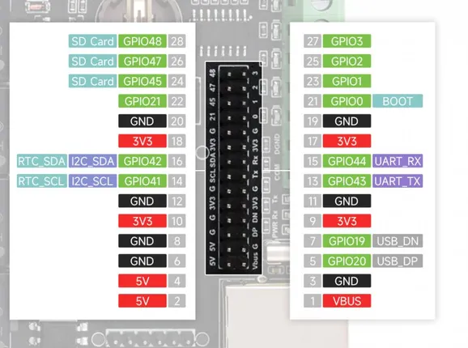

# ESP32-S3-ETH-8DI-8RO

**Waveshare** · ESP32-S3

Revision: Not identified  
Coverage: Pinout image collected

[Browse all manufacturers](../../../../BROWSE.md) · [Desktop app](https://github.com/valleytechsolutions/black-wire-desktop)

## Pinout

**pinout image** · Reviewed source · JPG

[Open original reference](../../../../library/media/da219a15f2224b33963bcd7d7cc4f69ac9c4d42b84401877e12f526d094d23a6.jpg)

**Credit and rights:** Not recorded; retain original attribution. Source/manufacturer: Waveshare.

[Source 1](https://www.waveshare.com/w/upload/c/cd/900px-ESP32-S3-ETH-8DI-8RO-details-2.jpg) · [Source 2](https://www.waveshare.com/wiki/ESP32-S3-ETH-8DI-8RO)

SHA-256: `da219a15f2224b33963bcd7d7cc4f69ac9c4d42b84401877e12f526d094d23a6`

Pin assignments have not been independently electrically verified. Check board revision before wiring.
