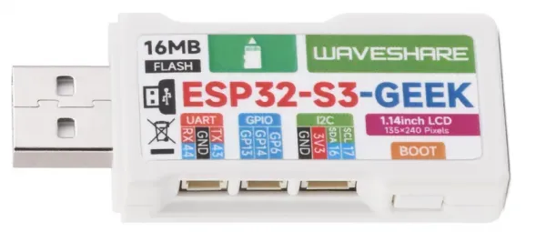

# ESP32-S3-GEEK

**Waveshare** · ESP32-S3

Revision: Not identified  
Coverage: Pinout image collected

[Browse all manufacturers](../../../../BROWSE.md) · [Desktop app](https://github.com/valleytechsolutions/black-wire-desktop)

## Pinout

**pinout image** · Reviewed source · PNG

[Open original reference](../../../../library/media/911bc1b12957c947c44f493654b4e5cb107d08e913f71610adec3bee2d3ca650.png)

**Credit and rights:** Not recorded; retain original attribution. Source/manufacturer: Waveshare.

[Source 1](https://www.waveshare.com/w/upload/8/83/ESP32-S3-GEEK-introduction-02.png) · [Source 2](https://www.waveshare.com/wiki/ESP32-S3-GEEK)

SHA-256: `911bc1b12957c947c44f493654b4e5cb107d08e913f71610adec3bee2d3ca650`

## Pinout

**pinout image** · Reviewed source · WEBP

[Open original reference](../../../../library/media/df5310e42363eb99e3b7c40466777f48cff56deb118013b706386496b1a854b6.webp)

**Credit and rights:** Not recorded; retain original attribution. Source/manufacturer: Waveshare.

[Source 1](https://docs.waveshare.com/assets/images/600px-ESP32-S3-GEEK-introduction-02-2b117a72a9ede7f7950b615115fa45f9.webp) · [Source 2](https://docs.waveshare.com/ESP32-S3-GEEK)

SHA-256: `df5310e42363eb99e3b7c40466777f48cff56deb118013b706386496b1a854b6`

Pin assignments have not been independently electrically verified. Check board revision before wiring.
