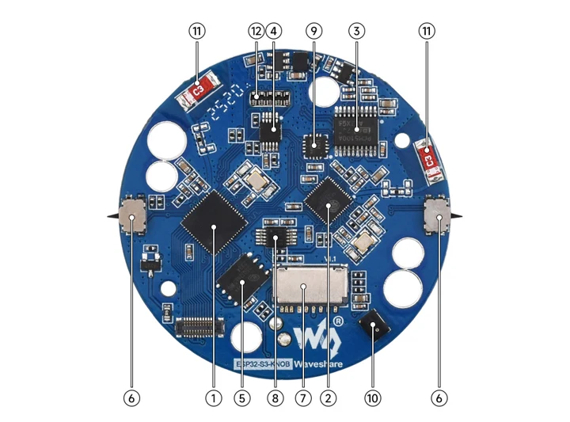
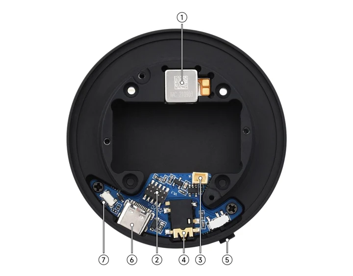

# ESP32-S3-Knob-Touch-LCD-1.8

**Waveshare** · ESP32-S3

Revision: Not identified

Coverage: Manufacturer references reviewed by scope; independent electrical and all-connector review pending

[Browse all manufacturers](../../../../BROWSE.md) · [Devices & IoT](../../../../DEVICES.md) · [Open in the browser guide](https://valleytech-black-wire-guide.pages.dev/?board=waveshare-esp32-esp32-s3-knob-touch-lcd-1-8)

## Datasheets and original documentation

Board datasheet: **not yet recorded**. Visual reference: **available**.

[Manufacturer hardware documentation](https://www.waveshare.com/wiki/ESP32-S3-Knob-Touch-LCD-1.8)

- **hardware-guide / board**: [Manufacturer pin and hardware documentation](https://www.waveshare.com/wiki/ESP32-S3-Knob-Touch-LCD-1.8) · online

A chip datasheet, schematic and board datasheet have different scopes. Match the exact hardware revision.

[Documentation coverage and remaining gaps](../../../../DOCUMENTATION.md)

## Onboard Resources

**board labeling image** · Source identity and visual scope inspected; PDF review covers first-page preview. Independent electrical and all-connector completeness review pending. · JPG

[Open original reference](../../../../library/media/bd5e02e22781fcc60ee1e3d4cc34ad66a5c941e168c30cf692d3fdede8517732.jpg)

**Credit and rights:** Manufacturer artwork; reuse and print rights not established. Inclusion does not relicense the original.. Source/manufacturer: Waveshare.

[Source 1](https://www.waveshare.com/w/upload/a/ae/ESP32-S3-Knob-Touch-LCD-1.8-12.jpg) · [Source 2](https://www.waveshare.com/wiki/ESP32-S3-Knob-Touch-LCD-1.8)

Manufacturer source retained unchanged. Source identity and visual scope inspected; PDF review covers first-page preview. Independent electrical and all-connector completeness review pending. See the linked manufacturer page for the numbered component legend. This is not a complete physical pinout.

Image revision: As supplied in the original; match exact board revision

SHA-256: `bd5e02e22781fcc60ee1e3d4cc34ad66a5c941e168c30cf692d3fdede8517732`

## Onboard Resources

**board labeling image** · Source identity and visual scope inspected; PDF review covers first-page preview. Independent electrical and all-connector completeness review pending. · JPG

[Open original reference](../../../../library/media/e9ee7f173bf5041e5c6cf094ed0b7596bc8723f0f6e0c50b7d5897610ca61472.jpg)

**Credit and rights:** Manufacturer artwork; reuse and print rights not established. Inclusion does not relicense the original.. Source/manufacturer: Waveshare.

[Source 1](https://www.waveshare.com/w/upload/d/d9/ESP32-S3-Knob-Touch-LCD-1.8-13.jpg) · [Source 2](https://www.waveshare.com/wiki/ESP32-S3-Knob-Touch-LCD-1.8)

Manufacturer source retained unchanged. Source identity and visual scope inspected; PDF review covers first-page preview. Independent electrical and all-connector completeness review pending. See the linked manufacturer page for the numbered component legend. This is not a complete physical pinout.

Image revision: As supplied in the original; match exact board revision

SHA-256: `e9ee7f173bf5041e5c6cf094ed0b7596bc8723f0f6e0c50b7d5897610ca61472`

Pin assignments have not been independently electrically verified. Check board revision before wiring.
