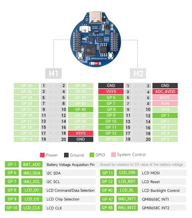
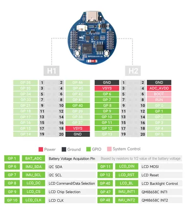
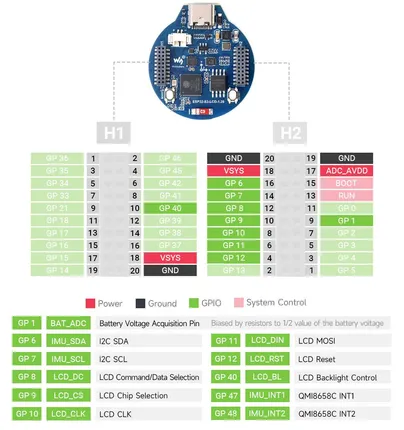
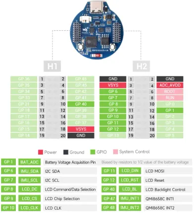

# ESP32-S3-LCD-1.28

**Waveshare** · ESP32-S3

Revision: Not identified  
Coverage: Pinout image collected

[Browse all manufacturers](../../../../BROWSE.md) · [Desktop app](https://github.com/valleytechsolutions/black-wire-desktop)

## Pinout

**pinout image** · Reviewed source · JPG

[Open original reference](../../../../library/media/ffdbcbe908b67abb5eab3b6c1c7d88ab0de9c91f64fd6a63faf7578a72714e69.jpg)

**Credit and rights:** Not recorded; retain original attribution. Source/manufacturer: Waveshare.

[Source 1](https://www.waveshare.com/img/devkit/ESP32-S3-LCD-1.28/ESP32-S3-LCD-1.28-details-inter.jpg?v=26050701) · [Source 2](https://www.waveshare.com/esp32-s3-lcd-1.28.htm)

SHA-256: `ffdbcbe908b67abb5eab3b6c1c7d88ab0de9c91f64fd6a63faf7578a72714e69`

## Pinout

**pinout image** · Reviewed source · JPG

[Open original reference](../../../../library/media/ebbcc25814719efc2406f01ac9798b25ba80ec9264abb73f35fd34107a8b9823.jpg)

**Credit and rights:** Not recorded; retain original attribution. Source/manufacturer: Waveshare.

[Source 1](https://www.waveshare.com/img/devkit/ESP32-S3-LCD-1.28-B/ESP32-S3-LCD-1.28-B-details-inter.jpg?v=26050802) · [Source 2](https://www.waveshare.com/esp32-s3-lcd-1.28-b.htm)

SHA-256: `ebbcc25814719efc2406f01ac9798b25ba80ec9264abb73f35fd34107a8b9823`

## Pinout

**pinout image** · Reviewed source · JPG

[Open original reference](../../../../library/media/c770c68e326ec2b652d79378c7eff8fb44cedfea1489eb4507e038a320e6b155.jpg)

**Credit and rights:** Not recorded; retain original attribution. Source/manufacturer: Waveshare.

[Source 1](https://www.waveshare.com/w/upload/6/66/Esp32-s3-lcd-1.28-002.jpg) · [Source 2](https://www.waveshare.com/wiki/ESP32-S3-LCD-1.28)

SHA-256: `c770c68e326ec2b652d79378c7eff8fb44cedfea1489eb4507e038a320e6b155`

## Pinout

**pinout image** · Reviewed source · WEBP

[Open original reference](../../../../library/media/57473f1e4a810fd097de05fb8fa36a893370dd04bb6fea1d1f56add65bc19fd7.webp)

**Credit and rights:** Not recorded; retain original attribution. Source/manufacturer: Waveshare.

[Source 1](https://docs.waveshare.com/assets/images/Esp32-s3-lcd-1.28-002-1060238584bb3acf3d75d12f192b72e3.webp) · [Source 2](https://docs.waveshare.com/ESP32-S3-LCD-1.28)

SHA-256: `57473f1e4a810fd097de05fb8fa36a893370dd04bb6fea1d1f56add65bc19fd7`

Pin assignments have not been independently electrically verified. Check board revision before wiring.
